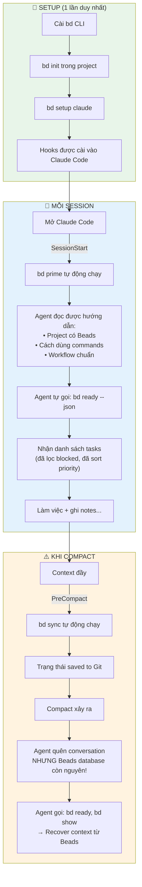
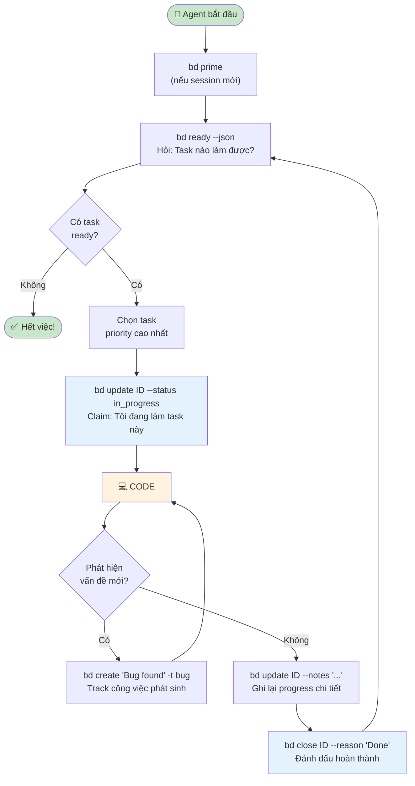

Đây là tất cả những gì tôi gom được về beads

# Beads - Hiểu từ Gốc đến Ngọn

> **Dành cho Junior Developer muốn hiểu Agentic Coding**

---

## Phần 1: Hiểu Vấn Đề Trước Khi Hiểu Giải Pháp

### 1.1 AI Agent là gì?

Hãy tưởng tượng bạn thuê một **lập trình viên ảo** làm việc cho bạn. Bạn giao task, nó code. Đó là AI Coding Agent (Claude Code, Cursor, Aider...).

**Nhưng có một vấn đề lớn:**

```
Bạn: "Hãy build feature Authentication cho tôi"

AI Agent: "OK, tôi sẽ:
1. Tạo database schema
2. Viết Login API
3. Thêm JWT middleware
4. Tạo Logout endpoint"

[... Agent làm được bước 1, 2 ...]

[Context window đầy → Compact/Clear]

AI Agent: "Xin chào! Tôi có thể giúp gì cho bạn?"

Bạn: "??? Bạn đang làm Authentication cho tôi mà!"

AI Agent: "Tôi không nhớ... Bạn có thể nói lại không?"
```

**Đây gọi là "Agent Amnesia" - Mất trí nhớ của Agent.**

### 1.2 Tại sao Agent bị mất trí nhớ?

```
┌─────────────────────────────────────────────────────────┐
│                   CONTEXT WINDOW                         │
│                   (Bộ nhớ của AI)                        │
│                                                          │
│  ┌──────────────────────────────────────────────────┐   │
│  │ System prompt + Conversation + Code + Files...    │   │
│  │                                                    │   │
│  │ Giới hạn: ~100k-200k tokens                       │   │
│  └──────────────────────────────────────────────────┘   │
│                                                          │
│  Khi đầy → COMPACT (nén) hoặc CLEAR (xóa)               │
│  → Mất conversation history                              │
│  → Agent quên đang làm gì                                │
└─────────────────────────────────────────────────────────┘
```

**Vấn đề cốt lõi:**
- AI Agent chỉ "nhớ" những gì trong context window
- Context window có giới hạn
- Khi compact/clear → mất thông tin
- Session mới = Agent không biết gì về session cũ

### 1.3 "Nhưng đã có Markdown file rồi mà?" - Câu hỏi quan trọng

Nhiều người sẽ hỏi: **"Spec-driven development đã dùng Markdown file (tasks.md, TODO.md) để track tasks rồi. Tại sao vẫn cần Beads?"**

Đây là câu hỏi **RẤT HAY** và cần được giải thích kỹ.

---

## Phần 2: Tại Sao Markdown Không Đủ Cho AI Agent?

### 2.1 Cách tiếp cận Markdown (Spec-Driven)

```markdown
# tasks.md

## TODO
- [ ] Setup database
- [ ] Create Login API (depends on: Setup database)
- [ ] Add JWT middleware (depends on: Setup database)
- [ ] Logout endpoint (depends on: Login API, JWT middleware)

## IN PROGRESS
- [ ] ...

## DONE
- [x] ...
```

**Có vẻ ổn rồi mà?** Agent đọc file này, biết task, biết dependency. 

**Vậy tại sao vẫn "trượt context"?**

### 2.2 Vấn đề 1: Markdown là "Implicit" - Agent phải tự suy luận

```markdown
# tasks.md
- [ ] Login API (depends on: Setup database)
```

Agent đọc được text, nhưng phải **tự suy luận**:
- "depends on" nghĩa là gì? Block hoàn toàn? Hay chỉ liên quan?
- "Setup database" đã done chưa? Phải tìm trong file
- Task nào priority cao hơn? Không rõ ràng

```
Agent đọc file và suy luận:
"Hmm, Login API depends on Setup database...
 Để tôi tìm Setup database trong file...
 Tìm thấy ở section TODO, chưa có dấu [x]...
 Vậy chắc là chưa done...
 Vậy tôi không nên làm Login API..."
```

**Vấn đề:** 
- Suy luận = **Tốn tokens** (phải "nghĩ")
- Suy luận = **Có thể sai** (hiểu nhầm format)

### So sánh với Beads:

```bash
$ bd ready --json
[{"id":"bd-1","title":"Setup database","priority":1}]
```

**Explicit - Rõ ràng:** 
- Chỉ tasks ready mới trả về
- Agent **không cần suy luận**
- Hỏi → Nhận câu trả lời chính xác

---

### 2.3 Vấn đề 2: Markdown không có "Query" - Phải đọc toàn bộ file

```
┌─────────────────────────────────────────────────────────┐
│                   MARKDOWN APPROACH                      │
│                                                          │
│   tasks.md có 500 dòng                                  │
│   ┌──────────────────────────────────────────────────┐  │
│   │ # Epic 1                                          │  │
│   │ - [ ] Task 1.1                                    │  │
│   │ - [ ] Task 1.2 (depends on 1.1)                  │  │
│   │ - [x] Task 1.3                                    │  │
│   │ # Epic 2                                          │  │
│   │ - [ ] Task 2.1                                    │  │
│   │ ... (hàng trăm dòng nữa)                         │  │
│   └──────────────────────────────────────────────────┘  │
│                                                          │
│   Agent muốn biết "task nào làm được?"                  │
│                                                          │
│   Phải: LOAD TOÀN BỘ FILE vào context                   │
│         → 500 dòng ≈ 2000 tokens                        │
│         → Parse text, tìm pattern [ ] và [x]            │
│         → Phân tích "depends on"                        │
│         → Suy luận task nào ready                       │
│         → MỖI LẦN HỎI đều tốn như vậy!                 │
│                                                          │
└─────────────────────────────────────────────────────────┘
```

```
┌─────────────────────────────────────────────────────────┐
│                    BEADS APPROACH                        │
│                                                          │
│   Agent muốn biết "task nào làm được?"                  │
│                                                          │
│   $ bd ready --json                                     │
│   ┌──────────────────────────────────────────────────┐  │
│   │ [{"id":"bd-1","title":"Setup database","p":1}]   │  │
│   └──────────────────────────────────────────────────┘  │
│                                                          │
│   Agent nhận: CHỈ DATA CẦN THIẾT                        │
│               → 1 task ready ≈ 50 tokens                │
│               → Đã filter xong                          │
│               → Đã sort theo priority                   │
│               → Không cần suy luận gì thêm              │
│                                                          │
└─────────────────────────────────────────────────────────┘
```

**Vấn đề cốt lõi:** Markdown không scale. Project lớn = file lớn = tốn context mỗi lần đọc.

---

### 2.4 Vấn đề 3: Markdown không track "Trạng thái giữa chừng"

Đây là vấn đề **NGHIÊM TRỌNG NHẤT**!

**Markdown chỉ có 2 trạng thái:**
```markdown
- [ ] Task chưa làm (TODO)
- [x] Task đã xong (DONE)
```

**Không có:**
- "Đang làm được 50%"
- "Đang đợi review"
- "Bị block bởi task khác"
- "Ai đang làm task này"

**Hậu quả khi compact giữa chừng:**

```
Session đang chạy:
├── Agent đọc tasks.md
├── Agent thấy: - [ ] Setup database (chưa làm)
├── Agent BẮT ĐẦU làm Setup database
├── Agent làm được 50% (schema xong, đang tạo migrations)
│
└── COMPACT XẢY RA (giữa chừng!)
    │
    ▼
    Agent mất conversation
    Agent đọc lại tasks.md
    Agent thấy: - [ ] Setup database (vẫn chưa check!)
    
    Agent nghĩ: "Task này chưa làm. Để tôi bắt đầu..."
    
    → LÀM LẠI TỪ ĐẦU! 😱
    → Code cũ có thể bị overwrite!
```

### So sánh với Beads:

```bash
# TRƯỚC compact - Agent ghi lại progress
$ bd update bd-1 --status in_progress
$ bd update bd-1 --notes "
  COMPLETED: Database schema designed, tables created
  IN PROGRESS: Creating migration files
  NEXT: Run migrations on dev server
  FILES: src/db/schema.sql, migrations/001_init.sql
"

[COMPACT XẢY RA]

# SAU compact - Agent query lại
$ bd show bd-1

Status: in_progress  ← Biết đang làm dở!
Notes: "COMPLETED: schema... IN PROGRESS: migrations..."

Agent: "À, tôi đang tạo migration files. File schema.sql đã xong.
        Tiếp tục tạo migrations..."

→ TIẾP TỤC ĐÚNG CHỖ! ✅
```

---

### 2.5 Vấn đề 4: Markdown dễ conflict khi nhiều người/agent edit

```
Alice và Bob cùng edit tasks.md:

Alice's version:
- [x] Setup database        ← Alice đánh dấu done
- [ ] Login API

Bob's version (cùng lúc):
- [ ] Setup database
- [x] Login API             ← Bob đánh dấu done

Git merge:
<<<<<<< Alice
- [x] Setup database
- [ ] Login API
=======
- [ ] Setup database  
- [x] Login API
>>>>>>> Bob

→ CONFLICT! Phải resolve thủ công
```

### So sánh với Beads:

```bash
# Alice tạo task
$ bd create "Setup database"    # → bd-a1b2 (hash)

# Bob tạo task (cùng lúc)
$ bd create "Login API"         # → bd-c3d4 (hash khác)

# Git merge: Không conflict!
# Vì mỗi task là 1 dòng riêng trong JSONL
# Và ID là hash, không trùng nhau
```

---

### 2.6 Tổng hợp: Markdown vs Beads cho Task Management

| Khía cạnh | Markdown (tasks.md) | Beads |
|-----------|---------------------|-------|
| **Cách lấy "task cần làm"** | Đọc toàn file, tự parse, tự suy luận | `bd ready` → nhận đúng tasks |
| **Context cost** | Toàn file (có thể 2000+ tokens) | Chỉ data cần (~50-100 tokens) |
| **Dependency** | Text mô tả, agent tự hiểu | Database enforce, tự động block |
| **Trạng thái** | Chỉ TODO/DONE | open/in_progress/blocked/closed + notes |
| **Track progress giữa chừng** | ❌ Không có | ✅ Notes chi tiết |
| **Nhiều người/agent edit** | Dễ conflict | Hash ID, auto-merge |
| **Sau compact** | Đọc lại toàn file, có thể hiểu sai | Query chính xác trạng thái |

---

### 2.7 Ví dụ thực tế: Cùng một tình huống, 2 cách tiếp cận

#### Với Markdown:

```
Session đang chạy:
│
├── Agent đọc tasks.md (tốn 2000 tokens)
├── Agent parse: "Task 3 depends on Task 1, 2..."
├── Agent suy luận: "Task 1, 2 chưa done → làm Task 1 trước"
├── Agent làm Task 1 được 50%
│
└── COMPACT XẢY RA
    │
    ▼
    Agent đọc lại tasks.md (tốn 2000 tokens LẦN NỮA)
    Agent thấy: - [ ] Task 1 (chưa có dấu [x])
    
    Agent: "Task 1 chưa làm. Để tôi bắt đầu..."
    
    → LÀM LẠI TỪ ĐẦU!
    → Tốn 4000 tokens chỉ để đọc file 2 lần
    → Công sức 50% bị mất
```

#### Với Beads:

```
Session đang chạy:
│
├── Agent: bd ready --json (tốn 50 tokens)
├── Output: [{"id":"bd-1","status":"open"}]
├── Agent: bd update bd-1 --status in_progress
├── Agent làm được 50%
├── Agent: bd update bd-1 --notes "Done: schema. Doing: migrations"
│
└── COMPACT XẢY RA
    │
    ▼
    Agent: bd ready --json (tốn 50 tokens)
    Output: [] (trống - vì bd-1 đang in_progress, không phải "ready")
    
    Agent: "Hmm, không có task ready. Có task nào đang làm dở không?"
    Agent: bd list --status in_progress
    Output: [{"id":"bd-1","status":"in_progress"}]
    
    Agent: bd show bd-1 (tốn 100 tokens)
    Output: {status: "in_progress", notes: "Done: schema. Doing: migrations"}
    
    Agent: "À, tôi đang làm migrations cho bd-1. Tiếp tục..."
    
    → TIẾP TỤC ĐÚNG CHỖ!
    → Chỉ tốn ~200 tokens
    → Không mất công sức
```

---

### 2.8 Kết luận: Tư duy đúng về Task Management cho AI Agent

```
┌─────────────────────────────────────────────────────────┐
│                                                          │
│   MARKDOWN = "Danh sách task" để ĐỌC và TỰ HIỂU         │
│                                                          │
│   • Agent đọc toàn bộ file                              │
│   • Agent tự parse format                                │
│   • Agent tự suy luận dependency                        │
│   • Agent tự xác định task nào làm được                 │
│   • → Tốn tokens, có thể sai, không track giữa chừng   │
│                                                          │
├─────────────────────────────────────────────────────────┤
│                                                          │
│   BEADS = "Hệ thống quản trị task" để HỎI và NHẬN      │
│                                                          │
│   • Agent hỏi: "Task nào làm được?"                     │
│   • Beads trả lời: Đây là danh sách (đã filter, sort)  │
│   • Agent hỏi: "Task này trạng thái gì?"               │
│   • Beads trả lời: Đang in_progress, notes là...       │
│   • → Ít tokens, chính xác, track đầy đủ               │
│                                                          │
└─────────────────────────────────────────────────────────┘
```

**Một câu tóm tắt:**

> **Markdown là "danh sách task" để đọc và tự hiểu.**
> **Beads là "hệ thống quản trị task" để hỏi và nhận câu trả lời.**
>
> Với Markdown: Agent đọc danh sách → Tự suy luận "task nào làm được" → Có thể sai, tốn tokens
>
> Với Beads: Agent hỏi "task nào làm được?" → Nhận đúng task cần làm → Chính xác, tiết kiệm

---

## Phần 3: Beads - Hệ Thống Quản Trị Task Thông Minh

### 3.1 Beads là gì?

Beads = **Issue Tracker** (như Jira, Trello) nhưng được thiết kế **cho AI Agent**, không phải cho con người.

> *"bd is a lightweight, git-based issue tracker designed for AI coding agents."*
> 
> *"bd là một issue tracker nhẹ, dựa trên git, được thiết kế cho AI coding agents."*

### 3.2 Điểm hay của Beads so với Jira/Trello thông thường

| Tính năng | Jira/Trello | Beads | Tại sao quan trọng? |
|-----------|-------------|-------|---------------------|
| **Giao diện** | Web UI cho người | CLI + JSON cho Agent | Agent không dùng được UI |
| **Query** | Click chuột | `bd ready --json` | Agent cần output có cấu trúc |
| **Storage** | Cloud server | Local Git | Không cần internet, sync qua git |
| **ID** | Số tuần tự (PROJ-1, PROJ-2) | Hash (bd-a1b2) | Tránh conflict khi nhiều agent |

### 3.3 Những điểm hay trong quản trị task của Beads

#### ✅ **1. Hệ thống Priority rõ ràng**

```bash
-p 0  # P0 - Critical (khẩn cấp nhất, làm ngay)
-p 1  # P1 - High (quan trọng)
-p 2  # P2 - Medium (bình thường)
-p 3  # P3 - Low (có thể chờ)
-p 4  # P4 - Backlog (làm khi rảnh)
```

**Tại sao hay?** Agent tự biết task nào làm trước:
```bash
$ bd ready --json
# Output: Trả về tasks theo thứ tự P0 → P1 → P2...
# Agent tự động chọn P0 trước
```

#### ✅ **2. Dependency - Sắp xếp task theo thứ tự logic**

Đây là điểm **TUYỆT VỜI** của Beads!

```
Ví dụ: Build feature Authentication

Task A: Setup database        ──┐
                                ├──→ Task C: Login API (phải đợi A, B)
Task B: Config OAuth          ──┘           │
                                            ▼
                              Task D: Logout (phải đợi C)
```

```bash
# Tạo tasks
bd create "Setup database" -p 1        # → bd-1
bd create "Config OAuth" -p 1          # → bd-2
bd create "Login API" -p 1             # → bd-3
bd create "Logout endpoint" -p 2       # → bd-4

# Thiết lập dependency
bd dep add bd-3 bd-1   # Login depends on Database
bd dep add bd-3 bd-2   # Login depends on OAuth
bd dep add bd-4 bd-3   # Logout depends on Login

# Giờ hỏi: Task nào ready?
$ bd ready
# Output: bd-1 (Setup database), bd-2 (Config OAuth)
# ✅ bd-3, bd-4 bị BLOCK - không hiện trong ready list!
```

**Tại sao hay?**
- Agent **KHÔNG THỂ** làm sai thứ tự
- Chỉ tasks không bị block mới xuất hiện trong `bd ready`
- Khi bd-1 và bd-2 closed → bd-3 tự động thành ready

#### ✅ **3. Auto-Ready Detection**

```bash
# Agent chỉ cần hỏi 1 câu:
$ bd ready --json

# Beads tự động:
# - Lọc tasks đang open
# - Loại bỏ tasks bị blocked
# - Sắp xếp theo priority
# - Trả về danh sách "việc có thể làm ngay"
```

Agent không cần suy nghĩ phức tạp. Hỏi → Nhận việc → Làm.

#### ✅ **4. Rich Status - Không chỉ TODO/DONE**

```bash
# Các trạng thái trong Beads:
open         # Chưa bắt đầu
in_progress  # Đang làm
blocked      # Bị chặn bởi task khác
closed       # Hoàn thành

# Kèm theo notes chi tiết:
bd update bd-1 --status in_progress --notes "
COMPLETED: Schema design
IN PROGRESS: Writing migrations
NEXT: Run on dev server
"
```

#### ✅ **5. Discovered Work - Track công việc phát sinh**

Đang làm task A, phát hiện bug B? Beads track được:

```bash
# Đang làm bd-10 (Add Payment)
# Phát hiện bug CORS

$ bd create "CORS bug" -t bug -p 0
# → bd-11

$ bd dep add bd-11 bd-10 --type discovered-from
# Ghi nhận: "bd-11 được phát hiện khi làm bd-10"
```

**Tại sao hay?** 
- Không mất track công việc phát sinh
- Audit trail: biết bug từ đâu ra
- Agent sau này đọc được lịch sử

#### ✅ **6. Hash-based ID - Không conflict**

```
Jira: PROJ-1, PROJ-2, PROJ-3... (tuần tự)
      → 2 người tạo cùng lúc = CONFLICT!

Beads: bd-a1b2, bd-c3d4, bd-e5f6... (hash ngẫu nhiên)
       → 2 agent tạo cùng lúc = OK, ID khác nhau!
```

#### ✅ **7. Hierarchical Structure - Epic/Task**

```bash
# Tạo Epic (nhóm lớn)
bd create "Auth System" -t epic -p 1
# → bd-a3f8

# Tạo Sub-tasks (tự động có suffix)
bd create "Login UI" -p 1 --parent bd-a3f8      # → bd-a3f8.1
bd create "Backend API" -p 1 --parent bd-a3f8   # → bd-a3f8.2
bd create "Unit Tests" -p 2 --parent bd-a3f8    # → bd-a3f8.3

# Khi TẤT CẢ children closed → Epic tự động closed!
```

#### ✅ **8. Git-Native - Sync tự động**

```bash
# Làm việc ở máy A
bd create "Fix bug" -p 1
git add .beads/
git commit -m "Add task"
git push

# Máy B (hoặc Agent khác)
git pull
bd ready  # Tự động thấy task mới!
```

---

## Phần 4: Beads + AI Agent = Cách Vận Hành

### 4.1 Vấn đề: Agent không tự biết về Beads

AI Agent **không tự động biết** project đang dùng Beads. Nó cần được **"dạy"**.

```
❌ KHÔNG CÓ HƯỚNG DẪN:
Agent: "Xin chào! Tôi có thể giúp gì?"
(Không biết có Beads, không biết có tasks)

✅ CÓ HƯỚNG DẪN:
Agent: "Tôi thấy project này dùng Beads. 
        Để tôi check tasks: bd ready --json
        Có 3 tasks ready. Bắt đầu với bd-1..."
```

### 4.2 Giải pháp: Hooks - Tự động "nhắc" Agent

**Hook = Lệnh tự động chạy khi có sự kiện**

```
┌─────────────────────────────────────────────────────────┐
│                    CLAUDE CODE                           │
│                                                          │
│  Event: SessionStart (mở Claude Code)                   │
│         ↓                                                │
│  Hook chạy: bd prime                                    │
│         ↓                                                │
│  Output: ~1-2k tokens hướng dẫn workflow                │
│         ↓                                                │
│  Agent đọc được → Biết có Beads → Biết cách dùng        │
│                                                          │
│  Event: PreCompact (trước khi compact context)          │
│         ↓                                                │
│  Hook chạy: bd sync                                     │
│         ↓                                                │
│  Lưu trạng thái → Không mất data khi compact            │
└─────────────────────────────────────────────────────────┘
```

### 4.3 `bd prime` - "Bản hướng dẫn" cho Agent

Khi chạy `bd prime`, nó output một đoạn text như:

```markdown
# Beads Workflow Context

## Core Rules
- Track strategic work in beads (multi-session, dependencies)
- Use `bd create` for issues
- Use `bd ready` to find work

## Essential Commands
- `bd ready --json` - Xem tasks sẵn sàng
- `bd update <id> --status in_progress` - Claim task
- `bd close <id> --reason "Done"` - Hoàn thành task

## Session Close Protocol
1. Commit code
2. Update beads notes
3. bd sync
4. git push
```

**Mục đích của `bd prime`:**
1. **Nhắc Agent:** "Có hệ thống Beads trong project này"
2. **Dạy Agent:** "Đây là các lệnh cơ bản"
3. **Hướng dẫn Agent:** "Khi làm task, hãy query Beads trước"

### 4.4 Tổng kết flow vận hành



---

## Phần 5: Workflow Chi Tiết cho Junior Dev

### 5.1 Vai trò của Con người vs Agent

```
┌─────────────────────────────────────────────────────────┐
│                      CON NGƯỜI                           │
│                    (Chiến lược)                          │
│                                                          │
│  • Lên plan: "Cần build Authentication"                 │
│  • Tạo Epic: bd create "Auth System" -t epic            │
│  • Tạo Tasks: bd create "Login API" -p 1                │
│  • Set Dependencies: bd dep add ...                     │
│  • Review kết quả                                        │
└─────────────────────────────────────────────────────────┘
                          ↓
┌─────────────────────────────────────────────────────────┐
│                      AI AGENT                            │
│                    (Chiến thuật)                         │
│                                                          │
│  • Query tasks: bd ready --json                         │
│  • Claim task: bd update <id> --status in_progress     │
│  • Code, code, code...                                  │
│  • Ghi notes: bd update <id> --notes "..."             │
│  • Close task: bd close <id> --reason "Done"           │
│  • Lặp lại cho đến khi hết tasks...                    │
└─────────────────────────────────────────────────────────┘
```

### 5.2 Agent Workflow Loop



### 5.3 Ví dụ cụ thể từng bước

**Bước 1: Human tạo tasks**
```bash
# Tạo Epic
$ bd create "User Authentication" -t epic -p 1
Created: bd-auth

# Tạo sub-tasks
$ bd create "Setup OAuth" -p 1 --parent bd-auth
Created: bd-auth.1

$ bd create "Login API" -p 1 --parent bd-auth
Created: bd-auth.2

$ bd create "JWT Middleware" -p 1 --parent bd-auth
Created: bd-auth.3

# Set dependencies
$ bd dep add bd-auth.2 bd-auth.1   # Login needs OAuth
$ bd dep add bd-auth.3 bd-auth.1   # JWT needs OAuth
```

**Bước 2: Agent query và làm việc**
```bash
# Agent hỏi: "Task nào làm được?"
Agent: $ bd ready --json
Output: [{"id":"bd-auth.1","title":"Setup OAuth","priority":1}]

# Chỉ có bd-auth.1 ready! (bd-auth.2, bd-auth.3 bị block)

Agent: "Tôi sẽ làm bd-auth.1 - Setup OAuth"

Agent: $ bd update bd-auth.1 --status in_progress

# ... Agent code OAuth integration ...

Agent: $ bd update bd-auth.1 --notes "
COMPLETED: Google OAuth integrated
NEXT: Test callback URLs
"

Agent: $ bd close bd-auth.1 --reason "OAuth setup complete"
```

**Bước 3: Dependency tự động unblock**
```bash
# Agent hỏi lại
Agent: $ bd ready --json
Output: [
  {"id":"bd-auth.2","title":"Login API","priority":1},
  {"id":"bd-auth.3","title":"JWT Middleware","priority":1}
]

# 2 tasks được unblock! (vì bd-auth.1 đã closed)

Agent: "bd-auth.2 và bd-auth.3 cùng priority. Làm bd-auth.2 trước..."
```

---

## Phần 6: Xử Lý Sau Compact

### 6.1 Điểm yếu cần biết

```
Timeline:
──────────────────────────────────────────────────────────►
│                    │                    │
▼                    ▼                    ▼
Session Start        Auto-Compact         Sau Compact
bd prime chạy ✅     bd sync chạy ✅      bd prime KHÔNG chạy ❌
Agent biết Beads     Data saved           Agent quên conversation
                                          NHƯNG Beads còn nguyên
```

**Vấn đề:** Sau compact, `bd prime` KHÔNG tự chạy lại. Agent cần tự query.

### 6.2 Giải pháp: Notes là "Thư gửi Agent tương lai"

> *"Write notes as if explaining to a future agent with zero conversation context."*
>
> *"Viết notes như thể giải thích cho agent tương lai không có context nào."*

```bash
# ❌ BAD - Notes vô nghĩa cho agent sau compact
bd update bd-1 --notes "Done"

# ✅ GOOD - Notes đầy đủ context
bd update bd-1 --notes "
COMPLETED: OAuth integration với Google provider
IN PROGRESS: Testing callback URLs
NEXT: Add GitHub OAuth provider
FILES CHANGED: src/auth/oauth.ts, config/providers.json
KEY DECISION: Dùng PKCE flow vì secure hơn
BLOCKERS: None
"
```

### 6.3 Hướng dẫn Agent trong CLAUDE.md

Thêm vào file `CLAUDE.md` của project:

```markdown
## ⚠️ Sau khi compact hoặc không nhớ context

Nếu không nhớ đang làm gì, LẬP TỨC chạy:
1. `bd ready --json` - Xem tasks sẵn sàng
2. `bd show <id>` - Xem chi tiết task (đọc notes!)

KHÔNG ĐƯỢC ĐOÁN. PHẢI query Beads trước.
```

---

## Phần 7: Cài Đặt Nhanh

```bash
# 1. Cài CLI
curl -fsSL https://raw.githubusercontent.com/steveyegge/beads/main/scripts/install.sh | bash

# 2. Khởi tạo trong project (⚠️ NHỚ ĐẶT PREFIX NGẮN!)
cd your-project
bd init --prefix myapp    # ← Quan trọng! Xem Phần 8

# 3. Setup hooks cho Claude Code
bd setup claude

# 4. Kiểm tra
bd doctor
```

**Xong!** Giờ mỗi khi mở Claude Code:
- `bd prime` tự chạy → Agent biết về Beads
- Agent sẽ tự `bd ready` → Nhận tasks
- Trước compact → `bd sync` tự chạy → Data saved

---

## Phần 8: ⚠️ ID Format và Prefix - Rất Quan Trọng!

### 8.1 Vấn đề ID xấu mà người mới thường gặp

Khi bạn chạy `bd init` mà **KHÔNG đặt prefix**, Beads có thể tạo ID rất dài và xấu:

```
❌ ID XẤU (không đặt prefix):
Competitor-Video-Analysis-System-ey3
My-Super-Long-Project-Name-abc123

✅ ID ĐẸP (có đặt prefix ngắn):
cvs-ey3
myapp-a1b2
auth-c3d4
```

### 8.2 Cấu trúc ID trong Beads

```
<prefix>-<hash>

Ví dụ:
┌────────┬───────┐
│ prefix │ hash  │
├────────┼───────┤
│ bd     │ a1b2  │  → bd-a1b2
│ myapp  │ c3d4  │  → myapp-c3d4
│ auth   │ e5f6  │  → auth-e5f6
└────────┴───────┘

Với Epic và Sub-tasks:
┌────────┬───────┬─────────┐
│ prefix │ hash  │ suffix  │
├────────┼───────┼─────────┤
│ auth   │ a3f8  │         │  → auth-a3f8 (Epic)
│ auth   │ a3f8  │ .1      │  → auth-a3f8.1 (Sub-task 1)
│ auth   │ a3f8  │ .2      │  → auth-a3f8.2 (Sub-task 2)
└────────┴───────┴─────────┘
```

### 8.3 Cách đặt Prefix đúng

#### Khi khởi tạo project MỚI:

```bash
# ✅ ĐÚNG - Đặt prefix ngắn gọn
bd init --prefix myapp
bd init --prefix cvs
bd init --prefix auth

# ❌ SAI - Không đặt prefix (hoặc prefix quá dài)
bd init
bd init --prefix my-super-long-project-name
```

#### Khi đã có database với prefix xấu:

Dùng lệnh `bd rename-prefix` để đổi:

```bash
# Bước 1: Xem prefix hiện tại
$ bd where
# Output: prefix: Competitor-Video-Analysis-System

# Bước 2: Preview đổi prefix (không thay đổi gì, chỉ xem trước)
$ bd rename-prefix cvs- --dry-run

# Output:
# Would rename 5 issues:
#   Competitor-Video-Analysis-System-ey3 → cvs-ey3
#   Competitor-Video-Analysis-System-f4g → cvs-f4g
#   ...

# Bước 3: Áp dụng đổi prefix
$ bd rename-prefix cvs-

# Bước 4: Verify
$ bd list
# Giờ thấy: cvs-ey3, cvs-f4g, ...
```

### 8.4 Khuyến nghị đặt tên Prefix

| Project | Prefix gợi ý | Ví dụ ID |
|---------|-------------|----------|
| Competitor Video System | `cvs-` | cvs-a1b2 |
| E-commerce App | `shop-` | shop-c3d4 |
| Authentication Service | `auth-` | auth-e5f6 |
| Mobile App | `app-` | app-g7h8 |
| API Backend | `api-` | api-i9j0 |

**Quy tắc:**
- **Ngắn:** 2-5 ký tự
- **Có nghĩa:** Dễ nhận ra project
- **Lowercase:** Dễ đọc, dễ gõ
- **Có dấu gạch ngang cuối:** `myapp-` (không bắt buộc nhưng clear hơn)

### 8.5 Các lệnh liên quan đến ID/Prefix

| Command | Mô tả |
|---------|-------|
| `bd init --prefix <name>` | Đặt prefix khi khởi tạo |
| `bd rename-prefix <new>` | Đổi prefix cho TẤT CẢ issues |
| `bd rename-prefix <new> --dry-run` | Preview đổi prefix (không thay đổi) |
| `bd where` | Xem database path và prefix hiện tại |
| `bd where --json` | Output JSON chi tiết |

### 8.6 Lưu ý quan trọng

```
⚠️ QUAN TRỌNG:

1. ĐẶT PREFIX NGAY KHI INIT
   → Tránh phải rename sau này
   
2. NẾU QUÊN ĐẶT PREFIX
   → Dùng bd rename-prefix để sửa
   → Lệnh này update TẤT CẢ issues trong database
   
3. SYNC SAU KHI RENAME
   → Chạy bd sync sau khi rename
   → Commit .beads/issues.jsonl vào git
```

---

## Phần 9: Cheat Sheet

### Human (Planning)
```bash
bd init --prefix <short-name>                       # Khởi tạo với prefix ngắn
bd create "Title" -t task|feature|bug|epic -p 0-4  # Tạo task
bd dep add <child> <parent>                         # Set dependency
bd list                                             # Xem tất cả
bd dep tree <id>                                    # Xem dependency tree
bd rename-prefix <new> --dry-run                    # Preview đổi prefix
bd rename-prefix <new>                              # Đổi prefix
```

### Agent (Execution)
```bash
bd ready --json                                    # Task nào làm được?
bd show <id>                                       # Chi tiết + notes
bd update <id> --status in_progress               # Claim task
bd update <id> --notes "..."                       # Ghi progress
bd close <id> --reason "Done"                      # Hoàn thành
```

### Maintenance
```bash
bd sync                # Sync với Git
bd doctor              # Kiểm tra health
bd prime               # Xem workflow guide
bd where               # Xem prefix và database path
```

---

## Phần 10: 🖥️ Beads UI - Giao Diện Trực Quan cho Beads

### 10.1 Vấn đề: CLI khó theo dõi với người mới

Beads là CLI-first, rất phù hợp cho AI Agent, nhưng với **con người** thì:

```
❌ Khó hình dung tổng quan tasks
❌ Không thấy được Board view như Trello/Jira
❌ Phải gõ lệnh liên tục để check status
```

### 10.2 Giải pháp: Beads UI

**Beads UI** là giao diện web local cho Beads, được tạo bởi cộng đồng.

> *"Local UI for Beads — Collaborate on issues with your coding agent."*

**GitHub:** https://github.com/mantoni/beads-ui

### 10.3 Tính năng chính

| Tính năng | Mô tả |
|-----------|-------|
| ✨ **Zero setup** | Chỉ cần `bdui start` |
| 📺 **Live updates** | Tự động cập nhật khi database thay đổi |
| 🔎 **Issues view** | Filter, search, edit inline |
| ⛰️ **Epics view** | Xem progress theo Epic, expand rows |
| 🏂 **Board view** | Kanban board: Blocked / Ready / In Progress / Closed |
| ⌨️ **Keyboard navigation** | Điều hướng không cần chuột |

### 10.4 Cài đặt và sử dụng

```bash
# Cài đặt global
npm i beads-ui -g

# Chạy trong project có Beads
cd your-project
bdui start --open    # Tự mở browser
```

**Lưu ý:** Project phải đã có `.beads/` (đã chạy `bd init`).

### 10.5 Các View trong Beads UI

#### 📋 Issues View
Xem danh sách tất cả issues, filter theo status, priority, search theo title.

```
┌─────────────────────────────────────────────────────────┐
│  🔎 Search...                    [Status ▼] [Priority ▼]│
├─────────────────────────────────────────────────────────┤
│  ID       │ Title              │ Status    │ Priority  │
├───────────┼────────────────────┼───────────┼───────────┤
│  bd-a1b2  │ Setup database     │ ✅ closed │ P1        │
│  bd-c3d4  │ Login API          │ 🔄 prog   │ P1        │
│  bd-e5f6  │ JWT Middleware     │ 🟡 ready  │ P1        │
│  bd-g7h8  │ Logout endpoint    │ 🔴 blocked│ P2        │
└─────────────────────────────────────────────────────────┘
```

#### ⛰️ Epics View
Xem progress của từng Epic, expand để thấy sub-tasks.

```
┌─────────────────────────────────────────────────────────┐
│  Epic                          │ Progress              │
├────────────────────────────────┼───────────────────────┤
│  ▶ bd-auth: Auth System        │ ████████░░ 75% (3/4)  │
│    ├── bd-auth.1: Setup OAuth  │ ✅ closed             │
│    ├── bd-auth.2: Login API    │ 🔄 in_progress        │
│    ├── bd-auth.3: JWT          │ 🟡 ready              │
│    └── bd-auth.4: Logout       │ 🔴 blocked            │
├────────────────────────────────┼───────────────────────┤
│  ▶ bd-pay: Payment System      │ ██░░░░░░░░ 20% (1/5)  │
└─────────────────────────────────────────────────────────┘
```

#### 🏂 Board View (Kanban)
Giống Trello - kéo thả tasks giữa các cột.

```
┌─────────────┬─────────────┬─────────────┬─────────────┐
│   BLOCKED   │    READY    │ IN PROGRESS │   CLOSED    │
├─────────────┼─────────────┼─────────────┼─────────────┤
│             │             │             │             │
│ ┌─────────┐ │ ┌─────────┐ │ ┌─────────┐ │ ┌─────────┐ │
│ │ Logout  │ │ │ JWT     │ │ │ Login   │ │ │ OAuth   │ │
│ │ bd-g7h8 │ │ │ bd-e5f6 │ │ │ bd-c3d4 │ │ │ bd-a1b2 │ │
│ │ P2      │ │ │ P1      │ │ │ P1      │ │ │ P1      │ │
│ └─────────┘ │ └─────────┘ │ └─────────┘ │ └─────────┘ │
│             │             │             │             │
└─────────────┴─────────────┴─────────────┴─────────────┘
```

### 10.6 Workflow kết hợp CLI + UI

```
┌─────────────────────────────────────────────────────────┐
│                     CON NGƯỜI                            │
│                                                          │
│  Dùng Beads UI để:                                      │
│  • Xem tổng quan (Board view)                           │
│  • Track progress (Epics view)                          │
│  • Quick edit inline                                    │
│                                                          │
└─────────────────────────────────────────────────────────┘
                          ↕ (sync qua database)
┌─────────────────────────────────────────────────────────┐
│                     AI AGENT                             │
│                                                          │
│  Dùng CLI để:                                           │
│  • bd ready --json                                      │
│  • bd update --status                                   │
│  • bd close --reason                                    │
│                                                          │
└─────────────────────────────────────────────────────────┘
```

**Live sync:** Khi Agent update task qua CLI → Beads UI tự động refresh!

### 10.7 Các lệnh Beads UI

```bash
bdui start              # Start server (default port 3000)
bdui start --open       # Start và mở browser
bdui start --port 8080  # Dùng port khác
bdui stop               # Stop server
bdui --help             # Xem tất cả options
```

### 10.8 Khi nào dùng UI vs CLI?

| Tình huống | Dùng |
|------------|------|
| Xem tổng quan project | 🖥️ **UI** - Board/Epics view |
| Tạo/edit nhiều tasks nhanh | 🖥️ **UI** - Inline edit |
| AI Agent làm việc | ⌨️ **CLI** - `bd ready`, `bd update` |
| Scripting/Automation | ⌨️ **CLI** - `--json` output |
| Demo cho team | 🖥️ **UI** - Trực quan hơn |

---

## Tóm Tắt Cuối

```
┌─────────────────────────────────────────────────────────┐
│                    BEADS LÀ GÌ?                          │
│                                                          │
│  Hệ thống quản trị task (như Jira) cho AI Agent         │
│                                                          │
├─────────────────────────────────────────────────────────┤
│                    GIẢI QUYẾT GÌ?                        │
│                                                          │
│  Agent Amnesia: AI quên khi compact context             │
│  → Beads = Bộ nhớ ngoài, persist trong Git              │
│                                                          │
├─────────────────────────────────────────────────────────┤
│              TẠI SAO KHÔNG DÙNG MARKDOWN?                │
│                                                          │
│  Markdown: Đọc toàn file → Suy luận → Có thể sai       │
│  Beads: Hỏi "task nào làm được?" → Nhận đúng task      │
│                                                          │
├─────────────────────────────────────────────────────────┤
│                    ĐIỂM HAY?                             │
│                                                          │
│  ✅ Priority: P0→P4, Agent biết làm gì trước            │
│  ✅ Dependency: Task bị block tự động                   │
│  ✅ Auto-ready: Hỏi 1 câu, nhận đúng tasks             │
│  ✅ Rich status: in_progress + notes chi tiết          │
│  ✅ Git-native: Sync tự động, team collaboration       │
│                                                          │
├─────────────────────────────────────────────────────────┤
│                    CÁCH VẬN HÀNH?                        │
│                                                          │
│  1. bd init --prefix <short> ← Đặt prefix ngắn!        │
│  2. bd prime (hook) → Nhắc Agent có Beads               │
│  3. Agent hỏi bd ready → Nhận tasks đã filter/sort     │
│  4. Agent làm việc, ghi notes vào Beads                │
│  5. bd sync (hook) → Save trước compact                 │
│  6. Sau compact: Query Beads → Context recovered        │
│                                                          │
├─────────────────────────────────────────────────────────┤
│              ⚠️ LƯU Ý QUAN TRỌNG CHO NGƯỜI MỚI          │
│                                                          │
│  • LUÔN đặt --prefix ngắn khi bd init                  │
│  • Nếu prefix xấu: bd rename-prefix <new>              │
│  • Prefix nên: 2-5 ký tự, lowercase, có nghĩa          │
│                                                          │
└─────────────────────────────────────────────────────────┘
```

---

## Resources

- **GitHub (Beads)**: https://github.com/steveyegge/beads
- **GitHub (Beads UI)**: https://github.com/mantoni/beads-ui
- **FAQ**: https://github.com/steveyegge/beads/blob/main/docs/FAQ.md
- **QUICKSTART**: https://github.com/steveyegge/beads/blob/main/docs/QUICKSTART.md
- **ADVANCED (rename-prefix)**: https://github.com/steveyegge/beads/blob/main/docs/ADVANCED.md

---

*Tài liệu này dành cho Junior Developer muốn hiểu Agentic Coding.*
*Được viết dựa trên tài liệu chính thức từ GitHub steveyegge/beads.*

# bd - Beads

**Distributed, git-backed graph issue tracker for AI agents.**

[](LICENSE)
[](https://goreportcard.com/report/github.com/steveyegge/beads)
[](https://github.com/steveyegge/beads/releases)
[](https://www.npmjs.com/package/@beads/bd)
[](https://pypi.org/project/beads-mcp/)

Beads provides a persistent, structured memory for coding agents. It replaces messy markdown plans with a dependency-aware graph, allowing agents to handle long-horizon tasks without losing context.

## ⚡ Quick Start

```bash
# Install (macOS/Linux/FreeBSD)
curl -fsSL https://raw.githubusercontent.com/steveyegge/beads/main/scripts/install.sh | bash

# Initialize (Humans run this once)
bd init

# Tell your agent
echo "Use 'bd' for task tracking" >> AGENTS.md

```

## 🛠 Features

* **Git as Database:** Issues stored as JSONL in `.beads/`. Versioned, branched, and merged like code.
* **Agent-Optimized:** JSON output, dependency tracking, and auto-ready task detection.
* **Zero Conflict:** Hash-based IDs (`bd-a1b2`) prevent merge collisions in multi-agent/multi-branch workflows.
* **Invisible Infrastructure:** SQLite local cache for speed; background daemon for auto-sync.
* **Compaction:** Semantic "memory decay" summarizes old closed tasks to save context window.

## 📖 Essential Commands

| Command | Action |
| --- | --- |
| `bd ready` | List tasks with no open blockers. |
| `bd create "Title" -p 0` | Create a P0 task. |
| `bd dep add <child> <parent>` | Link tasks (blocks, related, parent-child). |
| `bd show <id>` | View task details and audit trail. |

## 🔗 Hierarchy & Workflow

Beads supports hierarchical IDs for epics:

* `bd-a3f8` (Epic)
* `bd-a3f8.1` (Task)
* `bd-a3f8.1.1` (Sub-task)

**Stealth Mode:** Run `bd init --stealth` to use Beads locally without committing files to the main repo. Perfect for personal use on shared projects.

## 📦 Installation

* **npm:** `npm install -g @beads/bd`
* **Homebrew:** `brew install steveyegge/beads/bd`
* **Go:** `go install github.com/steveyegge/beads/cmd/bd@latest`

**Requirements:** Linux, FreeBSD, macOS, or Windows.

## 🌐 Community Tools

See [docs/COMMUNITY_TOOLS.md](docs/COMMUNITY_TOOLS.md) for a curated list of community-built UIs, extensions, and integrations—including terminal interfaces, web UIs, editor extensions, and native apps.

## 📝 Documentation

* [Installing](docs/INSTALLING.md) | [Agent Workflow](AGENT_INSTRUCTIONS.md) | [Sync Branch Mode](docs/PROTECTED_BRANCHES.md) | [Troubleshooting](docs/TROUBLESHOOTING.md) | [FAQ](docs/FAQ.md)
* [](https://deepwiki.com/steveyegge/beads)

# Installing bd

Complete installation guide for all platforms.

## Components Overview

Beads has several components - here's what they are and when you need them:

| Component | What It Is | When You Need It |
|-----------|------------|------------------|
| **bd CLI** | Core command-line tool | Always - this is the foundation |
| **Claude Code Plugin** | Slash commands + enhanced UX | Optional - if you want `/beads:ready`, `/beads:create` commands |
| **MCP Server (beads-mcp)** | Model Context Protocol interface | Only for MCP-only environments (Claude Desktop, Amp) |

**How they relate:**
- The **bd CLI** is the core - install it first via Homebrew, npm, or script
- The **Plugin** enhances Claude Code with slash commands but *requires* the CLI installed
- The **MCP server** is an *alternative* to the CLI for environments without shell access

**Typical setups:**

| Environment | What to Install |
|-------------|-----------------|
| Claude Code, Cursor, Windsurf | bd CLI (+ optional Plugin for Claude Code) |
| Claude Desktop (no shell) | MCP server only |
| Terminal / scripts | bd CLI only |
| CI/CD pipelines | bd CLI only |

**Are they mutually exclusive?** No - you can have CLI + Plugin + MCP all installed. They don't conflict. But most users only need the CLI.

## Quick Install (Recommended)

### Homebrew (macOS/Linux)

```bash
brew tap steveyegge/beads
brew install bd
```

**Why Homebrew?**
- ✅ Simple one-command install
- ✅ Automatic updates via `brew upgrade`
- ✅ No need to install Go
- ✅ Handles PATH setup automatically

### Quick Install Script (All Platforms)

```bash
curl -fsSL https://raw.githubusercontent.com/steveyegge/beads/main/scripts/install.sh | bash
```

The installer will:
- Detect your platform (macOS/Linux/FreeBSD, amd64/arm64)
- Install via `go install` if Go is available
- Fall back to building from source if needed
- Guide you through PATH setup if necessary

### Comparison of Installation Methods

| Method | Best For | Updates | Prerequisites | Notes |
|--------|----------|---------|---------------|-------|
| **Homebrew** | macOS/Linux users | `brew upgrade bd` | Homebrew | Recommended. Handles everything automatically |
| **npm** | JS/Node.js projects | `npm update -g @beads/bd` | Node.js | Convenient if npm is your ecosystem |
| **bun** | JS/Bun.js projects | `bun install -g --trust @beads/bd` | Bun.js | Convenient if bun is your ecosystem |
| **Install script** | Quick setup, CI/CD | Re-run script | curl, bash | Good for automation and one-liners |
| **go install** | Go developers | Re-run command | Go 1.24+ | Builds from source, always latest |
| **From source** | Contributors, custom builds | `git pull && go build` | Go, git | Full control, can modify code |
| **AUR (Arch)** | Arch Linux users | `yay -Syu` | yay/paru | Community-maintained |

**TL;DR:** Use Homebrew if available. Use npm if you're in a Node.js environment. Use the script for quick one-off installs or CI.

## Platform-Specific Installation

### macOS

**Via Homebrew** (recommended):
```bash
brew tap steveyegge/beads
brew install bd
```

**Via go install**:
```bash
go install github.com/steveyegge/beads/cmd/bd@latest
```

**From source**:
```bash
git clone https://github.com/steveyegge/beads
cd beads
go build -o bd ./cmd/bd
sudo mv bd /usr/local/bin/
```

### Linux

**Via Homebrew** (works on Linux too):
```bash
brew tap steveyegge/beads
brew install bd
```

**Arch Linux** (AUR):
```bash
# Install from AUR
yay -S beads-git
# or
paru -S beads-git
```

Thanks to [@v4rgas](https://github.com/v4rgas) for maintaining the AUR package!

**Via go install**:
```bash
go install github.com/steveyegge/beads/cmd/bd@latest
```

**From source**:
```bash
git clone https://github.com/steveyegge/beads
cd beads
go build -o bd ./cmd/bd
sudo mv bd /usr/local/bin/
```

### FreeBSD

**Via Quick Install Script**:
```bash
curl -fsSL https://raw.githubusercontent.com/steveyegge/beads/main/scripts/install.sh | bash
```

**Via go install**:
```bash
go install github.com/steveyegge/beads/cmd/bd@latest
```

### Windows 11

Beads now ships with native Windows support—no MSYS or MinGW required.

**Prerequisites:**
- [Go 1.24+](https://go.dev/dl/) installed (add `%USERPROFILE%\go\bin` to your `PATH`)
- Git for Windows

**Via PowerShell script**:
```pwsh
irm https://raw.githubusercontent.com/steveyegge/beads/main/install.ps1 | iex
```

**Via go install**:
```pwsh
go install github.com/steveyegge/beads/cmd/bd@latest
```

**From source**:
```pwsh
git clone https://github.com/steveyegge/beads
cd beads
go build -o bd.exe ./cmd/bd
Move-Item bd.exe $env:USERPROFILE\AppData\Local\Microsoft\WindowsApps\
```

**Verify installation**:
```pwsh
bd version
```

**Windows notes:**
- The background daemon listens on a loopback TCP endpoint recorded in `.beads\bd.sock`
- Keep that metadata file intact
- Allow `bd.exe` loopback traffic through any host firewall

## IDE and Editor Integrations

### CLI + Hooks (Recommended for Claude Code)

**The recommended approach** for Claude Code, Cursor, Windsurf, and other editors with shell access:

```bash
# 1. Install bd CLI (see Quick Install above)
brew install bd

# 2. Initialize in your project
cd your-project
bd init --quiet

# 3. Setup editor integration (choose one)
bd setup claude   # Claude Code - installs SessionStart/PreCompact hooks
bd setup cursor   # Cursor IDE - creates .cursor/rules/beads.mdc
bd setup aider    # Aider - creates .aider.conf.yml
```

**How it works:**
- Editor hooks/rules inject `bd prime` automatically on session start
- `bd prime` provides ~1-2k tokens of workflow context
- You use `bd` CLI commands directly
- Git hooks (installed by `bd init`) auto-sync the database

**Why this is recommended:**
- **Context efficient** - ~1-2k tokens vs 10-50k for MCP tool schemas
- **Lower latency** - Direct CLI calls, no MCP protocol overhead
- **Universal** - Works with any editor that has shell access
- **More sustainable** - Less compute per request

**Verify installation:**
```bash
bd setup claude --check   # Check Claude Code integration
bd setup cursor --check   # Check Cursor integration
bd setup aider --check    # Check Aider integration
```

### Claude Code Plugin (Optional)

For enhanced UX with slash commands:

```bash
# In Claude Code
/plugin marketplace add steveyegge/beads
/plugin install beads
# Restart Claude Code
```

The plugin adds:
- Slash commands: `/beads:ready`, `/beads:create`, `/beads:show`, `/beads:update`, `/beads:close`, etc.
- Task agent for autonomous execution

See [PLUGIN.md](PLUGIN.md) for complete plugin documentation.

### MCP Server (Alternative - for MCP-only environments)

**Use MCP only when CLI is unavailable** (Claude Desktop, Sourcegraph Amp without shell):

```bash
# Using uv (recommended)
uv tool install beads-mcp

# Or using pip
pip install beads-mcp
```

**Configuration for Claude Desktop** (macOS):

Add to `~/Library/Application Support/Claude/claude_desktop_config.json`:

```json
{
  "mcpServers": {
    "beads": {
      "command": "beads-mcp"
    }
  }
}
```

**Configuration for Sourcegraph Amp**:

Add to your MCP settings:

```json
{
  "beads": {
    "command": "beads-mcp",
    "args": []
  }
}
```

**Trade-offs:**
- ✅ Works in MCP-only environments
- ❌ Higher context overhead (MCP schemas add 10-50k tokens)
- ❌ Additional latency from MCP protocol

See [integrations/beads-mcp/README.md](../integrations/beads-mcp/README.md) for detailed MCP server documentation.

## Verifying Installation

After installing, verify bd is working:

```bash
bd version
bd help
```

## Troubleshooting Installation

### `bd: command not found`

bd is not in your PATH. Either:

```bash
# Check if installed
go list -f {{.Target}} github.com/steveyegge/beads/cmd/bd

# Add Go bin to PATH (add to ~/.bashrc or ~/.zshrc)
export PATH="$PATH:$(go env GOPATH)/bin"

# Or reinstall
go install github.com/steveyegge/beads/cmd/bd@latest
```

### `zsh: killed bd` or crashes on macOS

Some users report crashes when running `bd init` or other commands on macOS. This is typically caused by CGO/SQLite compatibility issues.

**Workaround:**
```bash
# Build with CGO enabled
CGO_ENABLED=1 go install github.com/steveyegge/beads/cmd/bd@latest

# Or if building from source
git clone https://github.com/steveyegge/beads
cd beads
CGO_ENABLED=1 go build -o bd ./cmd/bd
sudo mv bd /usr/local/bin/
```

If you installed via Homebrew, this shouldn't be necessary as the formula already enables CGO. If you're still seeing crashes with the Homebrew version, please [file an issue](https://github.com/steveyegge/beads/issues).

### Claude Code Plugin: MCP server fails to start

If the Claude Code plugin's MCP server fails immediately after installation, it's likely that `uv` is not installed or not in your PATH.

**Symptoms:**
- Plugin slash commands work, but MCP tools are unavailable
- Error logs show `command not found: uv`
- Server fails silently on startup

**Solution:**
```bash
# Install uv
curl -LsSf https://astral.sh/uv/install.sh | sh

# Restart your shell or update PATH
source ~/.local/bin/env

# Verify uv is available
which uv

# Restart Claude Code
```

See the "Claude Code Plugin" section above for alternative installation methods (Homebrew, pip).

## Next Steps

After installation:

1. **Initialize a project**: `cd your-project && bd init`
2. **Configure your agent**: Add bd instructions to `AGENTS.md` (see [README.md](../README.md#quick-start))
3. **Learn the basics**: See [QUICKSTART.md](QUICKSTART.md) for a tutorial
4. **Explore examples**: Check out the [examples/](../examples/) directory

## Updating bd

### Homebrew

```bash
brew upgrade bd
```

### go install

```bash
go install github.com/steveyegge/beads/cmd/bd@latest
```

### From source

```bash
cd beads
git pull
go build -o bd ./cmd/bd
sudo mv bd /usr/local/bin/
```

## Uninstalling

To completely remove Beads from a repository, see [UNINSTALLING.md](UNINSTALLING.md).

# Beads Quickstart

Get up and running with Beads in 2 minutes.

## Installation

```bash
cd ~/src/beads
go build -o bd ./cmd/bd
./bd --help
```

## Initialize

First time in a repository:

```bash
# Basic setup
bd init

# OSS contributor (fork workflow with separate planning repo)
bd init --contributor

# Team member (branch workflow for collaboration)
bd init --team

# Protected main branch (GitHub/GitLab)
bd init --branch beads-sync
```

The wizard will:
- Create `.beads/` directory and database
- Import existing issues from git (if any)
- Prompt to install git hooks (recommended)
- Prompt to configure git merge driver (recommended)
- Auto-start daemon for sync

## Your First Issues

```bash
# Create a few issues
./bd create "Set up database" -p 1 -t task
./bd create "Create API" -p 2 -t feature
./bd create "Add authentication" -p 2 -t feature

# List them
./bd list
```

**Note:** Issue IDs are hash-based (e.g., `bd-a1b2`, `bd-f14c`) to prevent collisions when multiple agents/branches work concurrently.

## Hierarchical Issues (Epics)

For large features, use hierarchical IDs to organize work:

```bash
# Create epic (generates parent hash ID)
./bd create "Auth System" -t epic -p 1
# Returns: bd-a3f8e9

# Create child tasks (automatically get .1, .2, .3 suffixes)
./bd create "Design login UI" -p 1       # bd-a3f8e9.1
./bd create "Backend validation" -p 1    # bd-a3f8e9.2
./bd create "Integration tests" -p 1     # bd-a3f8e9.3

# View hierarchy
./bd dep tree bd-a3f8e9
```

Output:
```
🌲 Dependency tree for bd-a3f8e9:

→ bd-a3f8e9: Auth System [epic] [P1] (open)
  → bd-a3f8e9.1: Design login UI [P1] (open)
  → bd-a3f8e9.2: Backend validation [P1] (open)
  → bd-a3f8e9.3: Integration tests [P1] (open)
```

## Add Dependencies

```bash
# API depends on database
./bd dep add bd-2 bd-1

# Auth depends on API
./bd dep add bd-3 bd-2

# View the tree
./bd dep tree bd-3
```

Output:
```
🌲 Dependency tree for bd-3:

→ bd-3: Add authentication [P2] (open)
  → bd-2: Create API [P2] (open)
    → bd-1: Set up database [P1] (open)
```

## Find Ready Work

```bash
./bd ready
```

Output:
```
📋 Ready work (1 issues with no blockers):

1. [P1] bd-1: Set up database
```

Only bd-1 is ready because bd-2 and bd-3 are blocked!

## Work the Queue

```bash
# Start working on bd-1
./bd update bd-1 --status in_progress

# Complete it
./bd close bd-1 --reason "Database setup complete"

# Check ready work again
./bd ready
```

Now bd-2 is ready! 🎉

## Track Progress

```bash
# See blocked issues
./bd blocked

# View statistics
./bd stats
```

## Database Location

By default: `~/.beads/default.db`

You can use project-specific databases:

```bash
./bd --db ./my-project.db create "Task"
```

## Migrating Databases

After upgrading bd, use `bd migrate` to check for and migrate old database files:

```bash
# Inspect migration plan (AI agents)
./bd migrate --inspect --json

# Check schema and config
./bd info --schema --json

# Preview migration changes
./bd migrate --dry-run

# Migrate old databases to beads.db
./bd migrate

# Migrate and clean up old files
./bd migrate --cleanup --yes
```

**AI agents:** Use `--inspect` to analyze migration safety before running. The system verifies required config keys and data integrity invariants.

## Database Maintenance

As your project accumulates closed issues, the database grows. Manage size with these commands:

```bash
# View compaction statistics
bd admin compact --stats

# Preview compaction candidates (30+ days closed)
bd admin compact --analyze --json --no-daemon

# Apply agent-generated summary
bd admin compact --apply --id bd-42 --summary summary.txt --no-daemon

# Immediately delete closed issues (CAUTION: permanent!)
bd admin cleanup --force
```

**When to compact:**
- Database file > 10MB with many old closed issues
- After major project milestones when old issues are no longer relevant
- Before archiving a project phase

**Note:** Compaction is permanent graceful decay. Original content is discarded but viewable via `bd restore <id>` from git history.

## Background Daemon

bd runs a background daemon for auto-sync and performance. You rarely need to manage it directly:

```bash
# Check daemon status
bd info | grep daemon

# List all running daemons
bd daemons list

# Force direct mode (skip daemon)
bd --no-daemon ready
```

**When to disable daemon:**
- Git worktrees (required: `bd --no-daemon`)
- CI/CD pipelines
- Resource-constrained environments

See [DAEMON.md](DAEMON.md) for complete daemon management guide.

## Next Steps

- Add labels: `./bd create "Task" -l "backend,urgent"`
- Filter ready work: `./bd ready --priority 1`
- Search issues: `./bd list --status open`
- Detect cycles: `./bd dep cycles`

See [README.md](../README.md) for full documentation.

# Detailed Agent Instructions for Beads Development

**For project overview and quick start, see [AGENTS.md](AGENTS.md)**

This document contains detailed operational instructions for AI agents working on beads development, testing, and releases.

## Development Guidelines

### Code Standards

- **Go version**: 1.24+
- **Linting**: `golangci-lint run ./...` (baseline warnings documented in [docs/LINTING.md](docs/LINTING.md))
- **Testing**: All new features need tests (`go test -short ./...` for local, full tests run in CI)
- **Documentation**: Update relevant .md files

### File Organization

```
beads/
├── cmd/bd/              # CLI commands
├── internal/
│   ├── types/           # Core data types
│   └── storage/         # Storage layer
│       └── sqlite/      # SQLite implementation
├── examples/            # Integration examples
└── *.md                 # Documentation
```

### Testing Workflow

**IMPORTANT:** Never pollute the production database with test issues!

**For manual testing**, use the `BEADS_DB` environment variable to point to a temporary database:

```bash
# Create test issues in isolated database
BEADS_DB=/tmp/test.db ./bd init --quiet --prefix test
BEADS_DB=/tmp/test.db ./bd create "Test issue" -p 1

# Or for quick testing
BEADS_DB=/tmp/test.db ./bd create "Test feature" -p 1
```

**For automated tests**, use `t.TempDir()` in Go tests:

```go
func TestMyFeature(t *testing.T) {
    tmpDir := t.TempDir()
    testDB := filepath.Join(tmpDir, ".beads", "beads.db")
    s := newTestStore(t, testDB)
    // ... test code
}
```

**Warning:** bd will warn you when creating issues with "Test" prefix in the production database. Always use `BEADS_DB` for manual testing.

### Before Committing

1. **Run tests**: `go test -short ./...` (full tests run in CI)
2. **Run linter**: `golangci-lint run ./...` (ignore baseline warnings)
3. **Update docs**: If you changed behavior, update README.md or other docs
4. **Commit**: Issues auto-sync to `.beads/issues.jsonl` and import after pull

### Commit Message Convention

When committing work for an issue, include the issue ID in parentheses at the end:

```bash
git commit -m "Fix auth validation bug (bd-abc)"
git commit -m "Add retry logic for database locks (bd-xyz)"
```

This enables `bd doctor` to detect **orphaned issues** - work that was committed but the issue wasn't closed. The doctor check cross-references open issues against git history to find these orphans.

### Git Workflow

**Auto-sync provides batching!** bd automatically:

- **Exports** to JSONL after CRUD operations (30-second debounce for batching)
- **Imports** from JSONL when it's newer than DB (e.g., after `git pull`)
- **Daemon commits/pushes** every 5 seconds (if `--auto-commit` / `--auto-push` enabled)

The 30-second debounce provides a **transaction window** for batch operations - multiple issue changes within 30 seconds get flushed together, avoiding commit spam.

### Git Integration

**Auto-sync**: bd automatically exports to JSONL (30s debounce), imports after `git pull`, and optionally commits/pushes.

**Protected branches**: Use `bd init --branch beads-metadata` to commit to separate branch. See [docs/PROTECTED_BRANCHES.md](docs/PROTECTED_BRANCHES.md).

**Git worktrees**: Enhanced support with shared database architecture. Use `bd --no-daemon` if daemon warnings appear. See [docs/GIT_INTEGRATION.md](docs/GIT_INTEGRATION.md).

**Merge conflicts**: Rare with hash IDs. If conflicts occur, use `git checkout --theirs/.beads/issues.jsonl` and `bd import`. See [docs/GIT_INTEGRATION.md](docs/GIT_INTEGRATION.md).

## Landing the Plane

**When the user says "let's land the plane"**, you MUST complete ALL steps below. The plane is NOT landed until `git push` succeeds. NEVER stop before pushing. NEVER say "ready to push when you are!" - that is a FAILURE.

**MANDATORY WORKFLOW - COMPLETE ALL STEPS:**

1. **File beads issues for any remaining work** that needs follow-up
2. **Ensure all quality gates pass** (only if code changes were made):
   - Run `make lint` or `golangci-lint run ./...` (if pre-commit installed: `pre-commit run --all-files`)
   - Run `make test` or `go test ./...`
   - File P0 issues if quality gates are broken
3. **Update beads issues** - close finished work, update status
4. **PUSH TO REMOTE - NON-NEGOTIABLE** - This step is MANDATORY. Execute ALL commands below:
   ```bash
   # Pull first to catch any remote changes
   git pull --rebase

   # If conflicts in .beads/issues.jsonl, resolve thoughtfully:
   #   - git checkout --theirs .beads/issues.jsonl (accept remote)
   #   - bd import -i .beads/issues.jsonl (re-import)
   #   - Or manual merge, then import

   # Sync the database (exports to JSONL, commits)
   bd sync

   # MANDATORY: Push everything to remote
   # DO NOT STOP BEFORE THIS COMMAND COMPLETES
   git push

   # MANDATORY: Verify push succeeded
   git status  # MUST show "up to date with origin/main"
   ```

   **CRITICAL RULES:**
   - The plane has NOT landed until `git push` completes successfully
   - NEVER stop before `git push` - that leaves work stranded locally
   - NEVER say "ready to push when you are!" - YOU must push, not the user
   - If `git push` fails, resolve the issue and retry until it succeeds
   - The user is managing multiple agents - unpushed work breaks their coordination workflow

5. **Clean up git state** - Clear old stashes and prune dead remote branches:
   ```bash
   git stash clear                    # Remove old stashes
   git remote prune origin            # Clean up deleted remote branches
   ```
6. **Verify clean state** - Ensure all changes are committed AND PUSHED, no untracked files remain
7. **Choose a follow-up issue for next session**
   - Provide a prompt for the user to give to you in the next session
   - Format: "Continue work on bd-X: [issue title]. [Brief context about what's been done and what's next]"

**REMEMBER: Landing the plane means EVERYTHING is pushed to remote. No exceptions. No "ready when you are". PUSH IT.**

**Example "land the plane" session:**

```bash
# 1. File remaining work
bd create "Add integration tests for sync" -t task -p 2 --json

# 2. Run quality gates (only if code changes were made)
go test -short ./...
golangci-lint run ./...

# 3. Close finished issues
bd close bd-42 bd-43 --reason "Completed" --json

# 4. PUSH TO REMOTE - MANDATORY, NO STOPPING BEFORE THIS IS DONE
git pull --rebase
# If conflicts in .beads/issues.jsonl, resolve thoughtfully:
#   - git checkout --theirs .beads/issues.jsonl (accept remote)
#   - bd import -i .beads/issues.jsonl (re-import)
#   - Or manual merge, then import
bd sync        # Export/import/commit
git push       # MANDATORY - THE PLANE IS STILL IN THE AIR UNTIL THIS SUCCEEDS
git status     # MUST verify "up to date with origin/main"

# 5. Clean up git state
git stash clear
git remote prune origin

# 6. Verify everything is clean and pushed
git status

# 7. Choose next work
bd ready --json
bd show bd-44 --json
```

**Then provide the user with:**

- Summary of what was completed this session
- What issues were filed for follow-up
- Status of quality gates (all passing / issues filed)
- Confirmation that ALL changes have been pushed to remote
- Recommended prompt for next session

**CRITICAL: Never end a "land the plane" session without successfully pushing. The user is coordinating multiple agents and unpushed work causes severe rebase conflicts.**

## Agent Session Workflow

**WARNING: DO NOT use `bd edit`** - it opens an interactive editor ($EDITOR) which AI agents cannot use. Use `bd update` with flags instead:
```bash
bd update <id> --description "new description"
bd update <id> --title "new title"
bd update <id> --design "design notes"
bd update <id> --notes "additional notes"
bd update <id> --acceptance "acceptance criteria"
```

**IMPORTANT for AI agents:** When you finish making issue changes, always run:

```bash
bd sync
```

This immediately:

1. Exports pending changes to JSONL (no 30s wait)
2. Commits to git
3. Pulls from remote
4. Imports any updates
5. Pushes to remote

**Example agent session:**

```bash
# Make multiple changes (batched in 30-second window)
bd create "Fix bug" -p 1
bd create "Add tests" -p 1
bd update bd-42 --status in_progress
bd close bd-40 --reason "Completed"

# Force immediate sync at end of session
bd sync

# Now safe to end session - everything is committed and pushed
```

**Why this matters:**

- Without `bd sync`, changes sit in 30-second debounce window
- User might think you pushed but JSONL is still dirty
- `bd sync` forces immediate flush/commit/push

**STRONGLY RECOMMENDED: Install git hooks for automatic sync** (prevents stale JSONL problems):

```bash
# One-time setup - run this in each beads workspace
bd hooks install
```

This installs:

- **pre-commit** - Flushes pending changes immediately before commit (bypasses 30s debounce)
- **post-merge** - Imports updated JSONL after pull/merge (guaranteed sync)
- **pre-push** - Exports database to JSONL before push (prevents stale JSONL from reaching remote)
- **post-checkout** - Imports JSONL after branch checkout (ensures consistency)

**Why git hooks matter:**
Without the pre-push hook, you can have database changes committed locally but stale JSONL pushed to remote, causing multi-workspace divergence. The hooks guarantee DB ↔ JSONL consistency.

**Note:** Hooks are embedded in the bd binary and work for all bd users (not just source repo users).

## Common Development Tasks

### CLI Design Principles

**Minimize cognitive overload.** Every new command, flag, or option adds cognitive burden for users. Before adding anything:

1. **Recovery/fix operations → `bd doctor --fix`**: Don't create separate commands like `bd recover` or `bd repair`. Doctor already detects problems - let `--fix` handle remediation. This keeps all health-related operations in one discoverable place.

2. **Prefer flags on existing commands**: Before creating a new command, ask: "Can this be a flag on an existing command?" Example: `bd list --stale` instead of `bd stale`.

3. **Consolidate related operations**: Related operations should live together. Daemon management uses `bd daemons {list,health,killall}`, not separate top-level commands.

4. **Count the commands**: Run `bd --help` and count. If we're approaching 30+ commands, we have a discoverability problem. Consider subcommand grouping.

5. **New commands need strong justification**: A new command should represent a fundamentally different operation, not just a convenience wrapper.

### Adding a New Command

1. Create file in `cmd/bd/`
2. Add to root command in `cmd/bd/main.go`
3. Implement with Cobra framework
4. Add `--json` flag for agent use
5. Add tests in `cmd/bd/*_test.go`
6. Document in README.md

### Adding Storage Features

1. Update schema in `internal/storage/sqlite/schema.go`
2. Add migration if needed
3. Update `internal/types/types.go` if new types
4. Implement in `internal/storage/sqlite/sqlite.go`
5. Add tests
6. Update export/import in `cmd/bd/export.go` and `cmd/bd/import.go`

### Adding Examples

1. Create directory in `examples/`
2. Add README.md explaining the example
3. Include working code
4. Link from `examples/README.md`
5. Mention in main README.md

## Building and Testing

```bash
# Build
go build -o bd ./cmd/bd

# Test (short - for local development)
go test -short ./...

# Test with coverage (full tests - for CI)
go test -coverprofile=coverage.out ./...
go tool cover -html=coverage.out

# Run locally
./bd init --prefix test
./bd create "Test issue" -p 1
./bd ready
```

## Version Management

**IMPORTANT**: When the user asks to "bump the version" or mentions a new version number (e.g., "bump to 0.9.3"), use the version bump script:

```bash
# Preview changes (shows diff, doesn't commit)
./scripts/bump-version.sh 0.9.3

# Auto-commit the version bump
./scripts/bump-version.sh 0.9.3 --commit
git push origin main
```

**What it does:**

- Updates ALL version files (CLI, plugin, MCP server, docs) in one command
- Validates semantic versioning format
- Shows diff preview
- Verifies all versions match after update
- Creates standardized commit message

**User will typically say:**

- "Bump to 0.9.3"
- "Update version to 1.0.0"
- "Rev the project to 0.9.4"
- "Increment the version"

**You should:**

1. Run `./scripts/bump-version.sh <version> --commit`
2. Push to GitHub
3. Confirm all versions updated correctly

**Files updated automatically:**

- `cmd/bd/version.go` - CLI version
- `claude-plugin/.claude-plugin/plugin.json` - Plugin version
- `.claude-plugin/marketplace.json` - Marketplace version
- `integrations/beads-mcp/pyproject.toml` - MCP server version
- `README.md` - Documentation version
- `PLUGIN.md` - Version requirements

**Why this matters:** We had version mismatches (bd-66) when only `version.go` was updated. This script prevents that by updating all components atomically.

See `scripts/README.md` for more details.

## Release Process (Maintainers)

**Automated (Recommended):**

```bash
# One command to do everything (version bump, tests, tag, Homebrew update, local install)
./scripts/release.sh 0.9.3
```

This handles the entire release workflow automatically, including waiting ~5 minutes for GitHub Actions to build release artifacts. See [scripts/README.md](scripts/README.md) for details.

**Manual (Step-by-Step):**

1. Bump version: `./scripts/bump-version.sh <version> --commit`
2. Update CHANGELOG.md with release notes
3. Run tests: `go test -short ./...` (CI runs full suite)
4. Push version bump: `git push origin main`
5. Tag release: `git tag v<version> && git push origin v<version>`
6. Update Homebrew: `./scripts/update-homebrew.sh <version>` (waits for GitHub Actions)
7. Verify: `brew update && brew upgrade bd && bd version`

See [docs/RELEASING.md](docs/RELEASING.md) for complete manual instructions.

## Checking GitHub Issues and PRs

**IMPORTANT**: When asked to check GitHub issues or PRs, use command-line tools like `gh` instead of browser/playwright tools.

**Preferred approach:**

```bash
# List open issues with details
gh issue list --limit 30

# List open PRs
gh pr list --limit 30

# View specific issue
gh issue view 201
```

**Then provide an in-conversation summary** highlighting:

- Urgent/critical issues (regressions, bugs, broken builds)
- Common themes or patterns
- Feature requests with high engagement
- Items that need immediate attention

**Why this matters:**

- Browser tools consume more tokens and are slower
- CLI summaries are easier to scan and discuss
- Keeps the conversation focused and efficient
- Better for quick triage and prioritization

**Do NOT use:** `browser_navigate`, `browser_snapshot`, or other playwright tools for GitHub PR/issue reviews unless specifically requested by the user.

## Questions?

- Check existing issues: `bd list`
- Look at recent commits: `git log --oneline -20`
- Read the docs: README.md, ADVANCED.md, EXTENDING.md
- Create an issue if unsure: `bd create "Question: ..." -t task -p 2`

## Important Files

- **README.md** - Main documentation (keep this updated!)
- **EXTENDING.md** - Database extension guide
- **ADVANCED.md** - JSONL format analysis
- **CONTRIBUTING.md** - Contribution guidelines
- **SECURITY.md** - Security policy

# Agent Instructions

See [AGENT_INSTRUCTIONS.md](AGENT_INSTRUCTIONS.md) for full instructions.

This file exists for compatibility with tools that look for AGENTS.md.

## Key Sections

- **Issue Tracking** - How to use bd for work management
- **Development Guidelines** - Code standards and testing
- **Visual Design System** - Status icons, colors, and semantic styling for CLI output

## Visual Design Anti-Patterns

**NEVER use emoji-style icons** (🔴🟠🟡🔵⚪) in CLI output. They cause cognitive overload.

**ALWAYS use small Unicode symbols** with semantic colors:
- Status: `○ ◐ ● ✓ ❄`
- Priority: `● P0` (filled circle with color)

See [AGENT_INSTRUCTIONS.md](AGENT_INSTRUCTIONS.md) for full development guidelines.

## Agent Warning: Interactive Commands

**DO NOT use `bd edit`** - it opens an interactive editor ($EDITOR) which AI agents cannot use.

Use `bd update` with flags instead:
```bash
bd update <id> --description "new description"
bd update <id> --title "new title"
bd update <id> --design "design notes"
bd update <id> --notes "additional notes"
bd update <id> --acceptance "acceptance criteria"
```

## Landing the Plane (Session Completion)

**When ending a work session**, you MUST complete ALL steps below. Work is NOT complete until `git push` succeeds.

**MANDATORY WORKFLOW:**

1. **File issues for remaining work** - Create issues for anything that needs follow-up
2. **Run quality gates** (if code changed) - Tests, linters, builds
3. **Update issue status** - Close finished work, update in-progress items
4. **PUSH TO REMOTE** - This is MANDATORY:
   ```bash
   git pull --rebase
   bd sync
   git push
   git status  # MUST show "up to date with origin"
   ```
5. **Clean up** - Clear stashes, prune remote branches
6. **Verify** - All changes committed AND pushed
7. **Hand off** - Provide context for next session

**CRITICAL RULES:**
- Work is NOT complete until `git push` succeeds
- NEVER stop before pushing - that leaves work stranded locally
- NEVER say "ready to push when you are" - YOU must push
- If push fails, resolve and retry until it succeeds