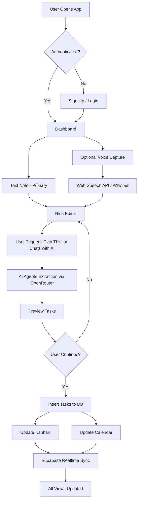

# "dumtasking" - Product Idea & Requirements Spec

**Project Name:** dumtasking (dumb/dump + tasking)  
**Tagline:** "Dump your notes, AI Agents handle the rest"  
**Current Date:** January 2026  
**Document Version:** 3.0

---

## 1. Overview / Product Description

**What is this product?**  
**dumtasking** is an AI Agents-powered productivity application that transforms your notes into organized, actionable task management systems. Users store notes (text or optional voice) and interact with AI through natural conversation to automatically extract tasks, set priorities, identify dependencies, suggest schedules, and generate Kanban boards and Calendar views—all through intelligent prompting and agent orchestration.

**Core value proposition (UVP):**  
*"Store your notes, chat with AI Agents, get perfect task plans—zero manual organizing."*

**Primary target users:**
- Knowledge workers and developers (25-45 years old, tech-savvy)
- Busy professionals juggling multiple projects with chaotic note-taking habits
- Users who want AI to handle planning through conversation, not manual task creation
- People frustrated with existing task managers that require too much manual organization

**Business objectives:**
- Reduce time spent organizing tasks from 2 hours/week to <10 minutes/week
- Achieve 70%+ task completion rate (vs. ~40% industry average for manual planning)
- Target 1,000 active users within 6 months post-launch
- Differentiate through conversational AI Agents and intelligent task orchestration

---

## 2. Problem & Pain Points

**Critical Pain Points:**

1. **"I have tons of notes but they're just sitting there doing nothing."**
   - Current workflow: Take notes → never revisit → notes become digital graveyard
   - Need: AI that proactively transforms notes into actionable plans

2. **"My notes are a chaotic mess—I spend more time organizing than actually doing the work."**
   - Current state: 50+ unstructured notes in various apps, no clear next actions
   - Manual task extraction takes 1-2 hours weekly and still incomplete

3. **"I don't know what to work on first—everything feels urgent."**
   - No systematic prioritization → reactive instead of proactive
   - Missed dependencies cause tasks to fail or block later work

4. **"Task management apps require too many clicks—I just want to dump notes and have AI figure it out."**
   - Todoist/Asana: 5-8 steps to create one task with proper metadata
   - Users abandon these tools after a week due to friction

5. **"I need to see tasks in multiple views (list, board, calendar) but switching apps is tedious."**
   - Current workflow: Notion for notes → Trello for board → Google Calendar → manual sync = chaos
   - Data gets out of sync, causing duplicated/missed work

6. **"I want to just tell AI what I need and have it handle my schedule intelligently."**
   - Current tools: Dumb buttons and forms, no conversational intelligence
   - Need: Chat with AI like a personal assistant, have it orchestrate tasks automatically

**Nice-to-Have Improvements:**

7. **"I want to review my week and get AI suggestions on what I should adjust."**
   - No tools offer intelligent retrospective analysis

8. **"Privacy concerns: I don't want my notes sent to random AI APIs without control."**
   - Desire to bring own API keys for full control

**Before State (Current Workflow):**
User takes notes in various apps → notes sit unused → manually copy to task manager → manually categorize → manually schedule → update 3 different tools → half the tasks are forgotten.

---

## 3. Solution Vision / Overall Approach

**High-Level Solution:**  
"AI Agents-Powered Notes to Tasks" leverages conversational AI orchestration (Claude 3.7 Sonnet / Gemini 2.0 Flash via Vercel AI SDK) to create a seamless notes storage → AI conversation → intelligent task planning pipeline. Users dump notes (text-first, voice optional), then chat with AI Agents to automatically extract tasks, set priorities, identify dependencies, optimize schedules, and manage everything through natural language—all synced across Kanban, Calendar, and Database views.

**Why this approach is superior:**
- **AI Agents conversation:** Natural language interface—just tell AI what you want ("plan this note", "optimize my week", "what should I do today")—no forms or manual clicking
- **Intelligent orchestration:** Multi-agent system handles task extraction, scheduling optimization, dependency resolution, and workload balancing autonomously
- **Notes as foundation:** All tasks derive from notes—maintains context and traceability, notes become your knowledge base
- **All-in-one:** Eliminates context-switching between 3-5 apps; everything stays synced via Supabase Realtime
- **Serverless & affordable:** Vercel + Supabase keeps costs low and scales effortlessly
- **Privacy option:** Users can bring their own API keys for full control

**Core Assumptions (If These Fail, Rethink the Product):**
1. Users prefer conversational AI interaction over manual forms/buttons for task management
2. LLMs (2026 era) can reliably extract structured tasks from messy notes with <10% error rate
3. Users trust AI Agents to prioritize/schedule/optimize tasks through conversation (vs. wanting full manual control)
4. Real-time sync is valuable enough to justify requiring internet connectivity
5. Users will pay $5-10/month for premium features after experiencing value

**Non-Goals / Out-of-Scope (Full-Feature Version):**
- ❌ No multi-user collaboration or project sharing (single-user focus)
- ❌ No Pomodoro timers or advanced time tracking (keep focus on planning, not execution tracking)
- ❌ No image/PDF OCR or multi-modal input beyond voice + text
- ❌ No custom LLM fine-tuning (rely on OpenRouter's routing to best models)
- ❌ No complex workflow automation (e.g., IFTTT-style rules)

**Now IN-SCOPE (moved from MVP non-goals):**
- ✅ Voice input as optional bonus feature (not voice-first)
- ✅ AI Chat Assistant for flexible interactions (like Blitzit's Blitzy)
- ✅ Smart daily suggestions ("What should I work on today?" - Motion-style)
- ✅ Auto-balance workload optimization (Motion-style redistribution)
- ✅ Knowledge graph for related tasks/dependencies (Mem.ai-style)
- ✅ External calendar export (one-way to Google Calendar - post-launch)
- ✅ Full offline mode with sync queue (PWA capability)

---

## 4. Target Users & Personas

### Persona 1: Alex - The Hustling Freelancer
- **Age:** 28, Freelance Developer
- **Goals:** Juggle 4-5 client projects, never miss deadlines, maintain work-life balance
- **Frustrations:** 
  - "I take tons of notes during client calls but they just sit in my note app unused"
  - "I waste 2 hours every Monday manually converting notes to tasks in Todoist"
  - "I miss deadlines because I forget to check my task list"
- **Tech-savviness:** High (uses Notion, VS Code, GitHub)
- **Ideal outcome:** Dump project notes → chat with AI: 'plan this note' → AI auto-creates prioritized tasks with realistic schedules → visual Kanban keeps him on track

### Persona 2: Sarah - The Startup Founder
- **Age:** 34, Co-founder of a SaaS startup
- **Goals:** Stay on top of product development, fundraising, and team management simultaneously
- **Frustrations:**
  - "My brain is overloaded with 50 things daily—I need AI to organize, not just capture"
  - "I have 100+ notes but no system to turn them into actionable plans"
  - "I hate manually breaking down big goals into actionable steps"
- **Tech-savviness:** Medium-high (uses Slack, Trello, Google Workspace)
- **Ideal outcome:** Dump meeting notes → chat with AI: 'extract action items and schedule them' → AI auto-generates task plan with optimal scheduling

### Persona 3: Jordan - The Busy Professional
- **Age:** 41, Marketing Manager at a corporate firm
- **Goals:** Manage campaigns, coordinate with agencies, report to executives
- **Frustrations:**
  - "I switch between 5 apps daily just to track my work"
  - "I want to just ask AI 'what should I work on today' and get intelligent answers"
  - "I need weekly reviews but manually creating them takes an hour"
- **Tech-savviness:** Medium (comfortable with web apps, avoids complex tools)
- **Ideal outcome:** One app for notes → tasks → schedule, with conversational AI that handles planning through chat

---

## 5. Key Features / Epics

### Feature 1: Quick Voice Capture (Optional Bonus) – Priority: ★★★☆☆
**Value:** Nice-to-have feature for users who want voice input as alternative to typing.

**User Story:**  
*As a busy professional, I want the option to record voice notes when typing is inconvenient so that I have flexible input methods.*

**Acceptance Criteria:**
- Microphone button visible in note editor (not prominently featured)
- One-tap recording starts (after initial permission)
- Audio recorded via MediaRecorder API, uploaded to Supabase Storage
- Basic STT transcription (Web Speech API or simple Whisper API)
- Transcript displays within 5 seconds
- Raw audio file linked to note for playback/verification
- Supports English language primarily
- Max recording length: 10 minutes (with warning at 9 minutes)

**Edge Cases:**
- Poor internet connection: Show "Uploading..." state, retry with exponential backoff
- Ambient noise: Display confidence score, allow re-recording
- Silent recording (no speech detected): Prompt user to check microphone

**Success Metrics:**
- Transcription accuracy >90% (user-reported via feedback) for users who enable voice
- 15-20% of users try voice feature at least once
- For voice users: Average recording length 1-3 minutes

---

### Feature 2: Rich Text Note Storage & Editor – Priority: ★★★★★
**Value:** Core foundation—all tasks derive from notes. Provides primary input method for brain dumps.

**User Story:**  
*As a user, I want to type or edit notes with rich formatting so that I can add context that might be hard to express via voice alone.*

**Acceptance Criteria:**
- Rich text editor (Tiptap or Lexical) with basic formatting: bold, italic, bullet lists, numbered lists
- Auto-save every 2 seconds (debounced)
- Markdown shortcuts supported (e.g., `##` for headings, `-` for lists)
- Edit voice transcripts inline after STT
- Character/word count displayed (optional toggle)
- Responsive design (optimized for desktop, works on tablets/phones)

**Edge Cases:**
- Conflict resolution if user edits on two devices simultaneously (last-write-wins with notification)
- Pasting large amounts of text: Warn if >10,000 characters (may impact AI processing time)

**Success Metrics:**
- 50%+ of notes include at least one manual edit
- Average edit session: <2 minutes

---

### Feature 3: AI Agents Task Extraction & Orchestration – Priority: ★★★★★
**Value:** The core "magic"—AI Agents convert messy notes into actionable, prioritized tasks through intelligent conversation and orchestration.

**User Story:**  
*As a user with a chaotic note, I want to tell AI "plan this note" (via button or chat) and have AI Agents automatically extract all tasks with priorities, time estimates, dependencies, and suggested schedules so that I don't waste time organizing manually.*

**Acceptance Criteria:**
- "Plan this" button visible on every note (disabled if note <20 characters)
- User confirms action if note >2000 characters (cost warning: "This may use ~$0.05 AI credits")
- AI processes note via Vercel AI SDK + OpenRouter (Claude 3.7 Sonnet or Gemini 2.0 Flash)
- Structured output follows strict Zod schema:
  ```typescript
  {
    tasks: [{
      title: string (20-60 chars),
      description: string (detailed),
      priority: "high" | "medium" | "low",
      estimated_time_minutes: number,
      dependencies: string[] (task titles that must complete first),
      suggested_due_date: "YYYY-MM-DD" | null
    }]
  }
  ```
- AI logic (enhanced with Motion/Blitzit best practices):
  - **Smart prioritization**: Analyzes urgency keywords ("urgent", "ASAP", "deadline") + importance keywords ("critical", "must", "important") → Eisenhower Matrix scoring
  - **Workload balancing**: Distributes tasks to avoid overload (max 8 hours/day default), suggests optimal days based on energy levels (complex tasks → morning slots)
  - **Dependency detection**: Uses semantic understanding to find blockers ("before", "after", "depends on", "once X is done") + detects implicit dependencies (e.g., "design mockup" must precede "code UI")
  - **Time-aware scheduling**: Respects working hours (8AM-8PM default), avoids weekends unless specified, considers task duration when assigning slots
  - **Context preservation**: Maintains reference to original note section for each task (helps AI Chat Assistant answer "Why is this task here?")
  - **Subtask breakdown**: Auto-generates subtasks for large tasks (>4 hours) with separate estimates
- Tasks inserted into database with status "pending_review"
- User sees preview modal with all extracted tasks (editable before confirming)
- Bulk confirm inserts tasks into Kanban/Calendar

**Edge Cases:**
- No tasks detected: Display "No actionable tasks found. Try adding more details."
- Ambiguous priorities: Default to "medium"
- Circular dependencies: Break cycle and warn user
- API rate limits: Queue requests, show "Processing..." with estimated wait time

**Success Metrics:**
- 85%+ of extracted tasks accepted without edits
- Average extraction time: <5 seconds
- 90%+ user satisfaction with priority assignments (survey)

---

### Feature 4: Realtime Kanban Board – Priority: ★★★★★
**Value:** Visual task management with drag-and-drop, synced in real-time across devices.

**User Story:**  
*As a user, I want to see all my tasks on a Kanban board and drag them between columns so that I can organize work visually and see progress at a glance.*

**Acceptance Criteria:**
- Three default columns: "To Do" / "In Progress" / "Done" (customizable labels later)
- Alternative view: "Today" / "This Week" / "Backlog"
- Drag-and-drop tasks between columns (dnd-kit library)
- Updates persist to database immediately
- Supabase Realtime broadcasts changes to all open sessions
- Tasks show: title, priority badge, time estimate
- Click task to open detail modal (edit fields, mark complete)
- Color-coding: red (high), yellow (medium), gray (low)
- Responsive drag-and-drop (works on touch devices with long-press)

**Edge Cases:**
- Two users drag same task simultaneously: Optimistic UI, resolve with last-write-wins
- Network disconnect: Show offline badge, queue changes, sync when reconnected
- Empty columns: Display placeholder "Drag tasks here"

**Improvements (from Reflect/Motion):**
- Quick filters: "Show only high-priority", "Show blocked tasks", "Show today's tasks"
- Bulk actions: Select multiple tasks → move all, change priority, reschedule
- Card density toggle: Compact (title only) vs. Detailed (show description + subtasks)
- Swimlanes option: Group by priority or by project/note source

**Success Metrics:**
- 80%+ users interact with Kanban weekly
- Average session time on Kanban: 5-10 minutes
- Task completion rate: 70%+
- <2 seconds drag-and-drop response time

---

### Feature 5: AI-Powered Calendar View – Priority: ★★★★☆
**Value:** Automatically schedules tasks across days/weeks based on AI suggestions.

**User Story:**  
*As a user, I want to see my tasks on a calendar and trust that AI has scheduled them optimally so that I don't spend time manually planning my week.*

**Acceptance Criteria:**
- Calendar view (FullCalendar or custom component): week view by default, month view optional
- Tasks auto-assigned to dates based on:
  - Priority (high → earlier)
  - Dependencies (blockers first)
  - Estimated time (balance workload, max 8 hours/day)
  - User's working hours preference (default 8AM-8PM)
  - **Energy optimization**: Complex tasks → morning slots (9-11AM), routine tasks → afternoon
- Drag-and-drop to reschedule tasks
- Visual density indicator: Green (<6 hours), Yellow (6-8 hours), Red (>8 hours)
- **Auto-balance button**: "Optimize my week" → AI redistributes all tasks for balanced workload
- **Smart warnings**: When dragging task causes overload → tooltip: "This will overload Tuesday (9h). Move Task X to Wednesday?"
- Click date to add ad-hoc task
- Sync with Kanban: Completing task on calendar updates board
- **Time blocks**: Visual representation of tasks as time blocks (not just all-day events)

**Edge Cases:**
- Overloaded day (>10 hours scheduled): AI **auto-suggests** specific redistribution → user confirms with one click ("Move 3 tasks to Wed/Thu?")
- Past-due tasks: Highlight in red, **AI suggests** new realistic due dates based on current workload
- Unscheduled tasks: Appear in "Unscheduled" sidebar with "Auto-schedule" button
- Conflicting tasks (same time slot): AI detects and prompts resolution

**Success Metrics:**
- 75%+ of AI-suggested dates accepted without changes
- 85%+ of auto-balance suggestions accepted
- 70%+ users check calendar view at least 3x/week
- <1 second calendar re-render after task move

---

### Feature 6: Realtime Sync Across Views – Priority: ★★★★★
**Value:** Ensures data consistency across Notes, Kanban, and Calendar without manual refreshes.

**User Story:**  
*As a user working across multiple devices, I want changes to sync instantly so that I always see the latest state without refreshing.*

**Acceptance Criteria:**
- Supabase Realtime subscriptions on `notes` and `tasks` tables
- Changes broadcast to all active sessions within 500ms
- Optimistic UI updates (assume success, rollback on error)
- Visual indicator when sync occurs (subtle pulse animation)
- Conflict resolution: Last-write-wins with timestamp, notify user of conflicts

**Edge Cases:**
- User offline: Queue changes locally, sync when online
- High-latency connection: Show "Syncing..." badge, timeout after 10 seconds

**Success Metrics:**
- 99.5%+ sync success rate
- <1 second average sync latency

---

### Feature 7: Settings & Customization – Priority: ★★★☆☆
**Value:** Allows users to tailor the app to their workflow and preferences.

**User Story:**  
*As a user, I want to configure my working hours, choose my preferred AI model, and manage API keys so that the app works the way I want.*

**Acceptance Criteria:**
- Settings page with sections:
  - **Profile:** Name, timezone (auto-detected from browser), working hours (default 9AM-6PM)
  - **AI Preferences:** Choose LLM model via OpenRouter (Claude 3.7, Gemini 2.0, etc.)
  - **API Keys (Advanced):** Bring your own OpenRouter/OpenAI keys (for LLM)
  - **Privacy:** Toggle analytics, data export
- Changes saved to user profile table
- AI processing respects selected model and keys

**Edge Cases:**
- Invalid API keys: Validate before saving, show error
- Timezone changes: Re-calculate all task due dates

**Success Metrics:**
- 30%+ users customize at least one setting
- <5% invalid API key errors

---

### Feature 8: Voice Commands (Optional Hands-Free) – Priority: ★★☆☆☆
**Value:** Nice-to-have bonus for users who want hands-free interaction (accessibility feature).

**User Story:**  
*As a user who occasionally needs hands-free interaction, I want to say "Add task: Call client tomorrow high priority" so that I have an alternative input method when typing is inconvenient.*

**Acceptance Criteria:**
- **Wake word detection**: "Hey dumtasking" or tap-and-hold mic button activates listening mode
- **Supported commands** (English only):
  - **Add task**: "Add task [title] [priority] [due date]" → creates task with metadata
    - Example: "Add task call client A tomorrow high priority" → Task created with due_date=tomorrow, priority=high
  - **Complete task**: "Mark [task title] as done" → moves to Done column
  - **List tasks**: "Show me today's tasks" / "What's high priority?" → AI displays tasks in chat
  - **Reschedule**: "Move [task title] to [date]" → updates due_date
  - **Query status**: "What should I work on now?" → AI suggests top task based on time/energy
  - **Summarize**: "Summarize my day" → AI shows completion rate + pending tasks
- **Confirmation for destructive actions**: "Mark task as done" → "I'll mark '[task title]' as complete. Confirm?" → user says "yes"
- **Context-aware**: If user says "mark it done" after listing tasks, AI infers "it" = last mentioned task
- **Text feedback primarily**: AI responds with text (voice TTS optional for accessibility)
- **Fallback to chat**: If command unclear → "I didn't understand. Did you mean: Add task or List tasks?"

**Edge Cases:**
- **Ambiguous task names**: "Mark project done" (multiple tasks match "project") → AI lists options: "Which one? 1) Project A kickoff, 2) Project B design"
- **Invalid dates**: "Add task tomorrow yesterday" → AI clarifies: "Did you mean tomorrow or yesterday?"
- **Background noise**: Confidence score <80% → "Sorry, I didn't catch that. Please repeat."
- **No tasks match**: "Complete task XYZ" (XYZ doesn't exist) → "I couldn't find task 'XYZ'. Did you mean [similar task]?"

**Implementation Details:**
- **Wake word**: Use browser Web Speech API (webkitSpeechRecognition) for wake word detection
- **STT**: Web Speech API or Whisper API for English command transcription
- **Intent parsing**: LLM (Claude 3.7 Sonnet) with structured output (Zod schema):
  ```typescript
  {
    intent: "add_task" | "complete_task" | "list_tasks" | "reschedule" | "query" | "summarize",
    parameters: {
      task_title?: string,
      priority?: "high" | "medium" | "low",
      due_date?: string, // parsed to YYYY-MM-DD
      filter?: "today" | "high_priority" | "all"
    }
  }
  ```
- **Text-first responses**: Display results in chat panel; optional TTS for accessibility

**Success Metrics:**
- 60%+ users try voice commands within first week
- 40%+ users use voice commands at least 2x/week
- 90%+ command accuracy (intent correctly parsed)
- <2 seconds command execution time (STT → intent → action)

---

### Feature 9: AI Chat Assistant (Conversational Task Manager) – Priority: ★★★★★
**Value:** Flexible interaction model (like Blitzit's Blitzy, Mem Chat) for power users who need more than buttons.

**User Story:**  
*As a user, I want to chat with an AI assistant about my tasks and notes so that I can quickly extract insights, reorganize work, or get suggestions without clicking through multiple views.*

**Acceptance Criteria:**
- **Floating chat widget**: Bottom-right corner, expandable (minimized = small circle icon, expanded = 400x600px panel)
- **Context-aware**: AI has access to:
  - All user's notes (content + metadata)
  - All tasks (title, description, priority, due_date, status, dependencies)
  - Current calendar state (workload per day)
  - User preferences (working hours, timezone)
- **Supported interactions**:
  - **Extract tasks from note**: "Turn this note into tasks" → AI extracts + shows preview (same as "Plan this" button)
  - **Summarize work**: "Summarize my week" / "What did I complete today?" → AI generates summary
  - **Smart queries**: "What should I work on now?" → AI suggests task based on time, priority, dependencies
  - **Reschedule requests**: "Move all high-priority tasks to next week" → AI shows plan, user confirms
  - **Find tasks**: "Show me tasks related to Client A" → AI searches + lists tasks
  - **Explain decisions**: "Why is this task scheduled for tomorrow?" → AI explains reasoning (priority, dependencies, workload)
  - **Quick edits**: "Change task X priority to low" → AI updates task
  - **Proactive suggestions**: "You have 3 overdue tasks. Should I reschedule them?" (AI initiates conversation)
- **Streaming responses**: Use Vercel AI SDK streaming for real-time feedback
- **Message history**: Persisted per session (cleared on page refresh or user clears)
- **Quick actions**: AI responses include actionable buttons (e.g., "Reschedule these 3 tasks" → [Confirm] button)
- **Responsive panel**: Collapsible sidebar on smaller screens, always visible on desktop

**Edge Cases:**
- **Ambiguous requests**: "Reschedule everything" → AI clarifies: "Do you mean all pending tasks or just today's tasks?"
- **Large operations**: "Delete all tasks" → AI requires explicit confirmation: "This will delete 47 tasks. Type 'confirm delete' to proceed."
- **Rate limiting**: Max 50 messages/hour to prevent abuse
- **Offline**: Chat disabled when offline, shows "Connect to internet to chat with AI"

**Implementation Details:**
- **UI**: shadcn/ui Dialog component, floating + expandable
- **LLM**: Claude 3.7 Sonnet via Vercel AI SDK (streaming)
- **System prompt**: Inject user context (notes, tasks, calendar) + capabilities + tone ("You are a helpful productivity assistant for dumtasking. Help users organize their notes into actionable tasks...")
- **Tool calling**: AI can call functions:
  - `extract_tasks(note_id)` → trigger task extraction
  - `update_task(task_id, updates)` → modify task
  - `search_tasks(query)` → find tasks
  - `reschedule_tasks(task_ids, new_dates)` → batch reschedule
  - `generate_summary(date_range)` → create report

**Success Metrics:**
- 70%+ users try chat within first 2 weeks
- 50%+ users use chat at least 1x/week
- Average conversation length: 3-5 messages
- 85%+ user satisfaction with AI responses (survey)

---

### Feature 10: Smart Daily Suggestions (Morning Dashboard) – Priority: ★★★★★
**Value:** Answers "What should I work on today?" (Motion's killer feature) → reduces decision paralysis.

**User Story:**  
*As a user starting my workday, I want to see AI-curated suggestions for today so that I don't waste time deciding what to work on and can jump straight into focused work.*

**Acceptance Criteria:**
- **Morning greeting**: Dashboard shows personalized message: "Good morning [Name]! Here's your focus for today:"
- **Top 3 tasks for today**: AI selects based on:
  - **Due today or overdue** (highest priority)
  - **High priority** (user-assigned or AI-inferred)
  - **No blockers** (all dependencies complete)
  - **Realistic time** (total ≤ user's available hours today)
  - **Energy match**: Complex tasks if morning, routine tasks if late day
- **Quick insights**:
  - "🔥 2 high-priority tasks due today"
  - "⏰ 1 overdue task needs attention"
  - "🚧 3 tasks blocked (waiting on dependencies)"
  - "✅ You completed 5 tasks yesterday—great job!"
- **Suggested schedule**: "Start with [Task A] (2h), then [Task B] (1h), finish with [Task C] (30m)—total 3.5 hours"
- **One-click actions**:
  - "Start [Task A]" → moves to "In Progress" + starts timer (optional)
  - "Reschedule overdue tasks" → AI suggests new dates
  - "Show all tasks" → opens Kanban view
- **Blocked tasks alert**: "Task X is blocked by Task Y. Want to work on Task Y first?"
- **Quick wins section**: "Low-effort, high-impact tasks you can finish in <30 min" (motivational)
- **Adaptive**: If user completes suggested tasks early → AI suggests next batch
- **Time-sensitive**: If user opens app at 4 PM → AI adjusts: "You have 4 hours left today. Focus on [shorter tasks]."

**Edge Cases:**
- **No tasks**: "No tasks for today! Want to create some from your notes?"
- **All tasks blocked**: "All tasks are blocked. Here's what to unblock them: [list dependencies]"
- **Overloaded**: "You have 12 hours scheduled today (overloaded). I suggest moving [3 tasks] to tomorrow."

**Implementation Details:**
- **AI selection algorithm** (runs on dashboard load):
  1. Filter tasks: `status = 'todo' AND (due_date = today OR due_date < today OR priority = 'high')`
  2. Remove blocked: Check dependencies → exclude if any dependency not complete
  3. Sort by: Priority (high first) → Due date (earliest first) → Estimated time (shorter first)
  4. Balance time: Select top tasks until sum(estimated_time) ≤ user's working hours
  5. Add quick wins: Find tasks <30 min → show separately
- **Caching**: Cache suggestions for 1 hour (recompute if tasks change)
- **Personalization** (future): Learn from user behavior (e.g., user always starts with emails → suggest email-related tasks first)

**Success Metrics:**
- 80%+ users see dashboard suggestions daily
- 70%+ users start with a suggested task (click "Start")
- 65%+ of suggested tasks completed same day
- User survey: "Suggestions help me focus" → 85%+ agree

---

### Feature 11: Tasks Aggregation View (All Tasks Hub) – Priority: ★★★★☆
**Value:** Central place to see ALL tasks across all notes (Reflect's Tasks tab) → eliminates need to hunt through notes.

**User Story:**  
*As a user with tasks scattered across 50+ notes, I want a single view of all pending tasks so that I can see my full workload and find tasks quickly without remembering which note they came from.*

**Acceptance Criteria:**
- **New tab**: "Tasks" (icon: checkbox list) alongside Notes/Kanban/Calendar
- **List view**: All tasks displayed in sortable table:
  - Columns: Title, Priority (badge), Due Date, Status, Estimated Time, Source Note (clickable link)
  - Sortable by: Priority, Due Date, Created Date, Estimated Time, Status
  - Default sort: Priority (high→low) → Due Date (earliest→latest)
- **Filters** (multi-select):
  - **Status**: To Do / In Progress / Done (default: show To Do + In Progress only)
  - **Priority**: High / Medium / Low
  - **Date range**: Today / This Week / This Month / Overdue / Unscheduled / Custom range
  - **Source note**: Filter by note title (useful for project-specific tasks)
- **Search**: Full-text search across task titles + descriptions
- **Bulk actions**: Select multiple tasks (checkboxes) → actions:
  - Change priority (bulk)
  - Reschedule (bulk - AI suggests optimal dates)
  - Mark complete (bulk)
  - Delete (bulk - with confirmation)
  - Move to different note (bulk)
- **Grouped views** (toggle):
  - Group by Priority (High / Medium / Low sections)
  - Group by Status (To Do / In Progress / Done)
  - Group by Due Date (Today / Tomorrow / This Week / Later)
  - Group by Source Note (show tasks under their originating note)
- **Quick actions per task**:
  - Drag handle → reorder tasks (changes priority order)
  - Edit button → inline edit title/description
  - Calendar icon → quick reschedule (date picker)
  - Checkbox → mark complete
  - Link icon → jump to source note
- **Empty state**: "No tasks yet. Create tasks by processing your notes!"

**Edge Cases:**
- **Large task lists** (>500 tasks): Virtual scrolling (only render visible rows)
- **Conflicting filters**: "Show completed + overdue" (completed can't be overdue) → AI resolves: "Showing completed tasks (overdue filter ignored)"
- **Deleted source note**: Task remains, source note shows "(deleted)" with option to re-attach to different note

**Implementation Details:**
- **UI**: TanStack Table (react-table v8) for sortable, filterable table
- **Performance**: Virtualized scrolling (react-virtual) for >100 tasks
- **State sync**: Changes in Tasks view → instantly update Kanban/Calendar (Supabase Realtime)
- **URL state**: Filters persist in URL params (e.g., `/tasks?status=todo&priority=high`) → shareable links

**Success Metrics:**
- 60%+ users visit Tasks view at least 2x/week
- 50%+ users use filters regularly
- 30%+ users perform bulk actions
- Average time to find specific task: <10 seconds

---

### Feature 12: Knowledge Graph / Related Tasks (Smart Connections) – Priority: ★★★☆☆
**Value:** Auto-discover connections between tasks/notes (Mem.ai's knowledge graph) → better dependency detection + context.

**User Story:**  
*As a user juggling multiple projects, I want to see which tasks are related to each other so that I can understand the bigger picture and avoid missing dependencies.*

**Acceptance Criteria:**
- **Auto-linking**: AI detects relationships between tasks/notes:
  - **Explicit dependencies**: User writes "After Task A, do Task B" → Task B.dependencies = [Task A]
  - **Semantic similarity**: "Design landing page" relates to "Code landing page UI" → AI suggests link
  - **Shared entities**: Both tasks mention "Client A" → grouped under Client A
  - **Temporal proximity**: Tasks created from same note or same time period → loosely related
- **Related Tasks panel**: When viewing a task detail modal → show "Related Tasks" section:
  - "Dependencies" (blockers)
  - "Dependent tasks" (tasks blocked by this one)
  - "Similar tasks" (AI-suggested based on content similarity)
  - "From same note" (tasks extracted from same brain-dump)
- **Visual graph view** (optional, post-launch): Network diagram showing tasks as nodes, dependencies as edges
- **Smart suggestions**: When creating task → AI suggests: "This might depend on [Task X]. Add as dependency?"
- **Auto-update dependencies**: If user completes Task A → notify: "Task B is now unblocked (was waiting on Task A)"

**Edge Cases:**
- **Circular dependencies**: AI detects loop (Task A → Task B → Task A) → warns user: "Circular dependency detected. Please review."
- **Too many relations**: Limit to top 5 most relevant related tasks (avoid clutter)
- **False positives**: User can dismiss suggested relations → AI learns (future: improve model)

**Implementation Details:**
- **Embeddings**: Generate embeddings for task titles + descriptions (OpenAI text-embedding-3-small via OpenRouter)
- **Vector search**: Store embeddings in Supabase (pgvector extension) → cosine similarity search for related tasks
- **Dependency graph**: Store in `tasks.dependencies` (jsonb array of task IDs)
- **Real-time updates**: When task completed → trigger webhook to notify dependent tasks

**Success Metrics:**
- 70%+ of auto-detected dependencies accepted by users
- 40%+ users explore Related Tasks panel
- 20% reduction in missed dependencies (compared to manual entry)

---

### Feature 13: Weekly AI Review (Retrospective & Planning) – Priority: ★★★☆☆
**Value:** Provides insights and suggestions for improving productivity (Motion/Reflect-style retrospectives).

**User Story:**  
*As a user, I want a weekly AI-generated summary of completed vs. pending tasks with suggestions for next week so that I can improve my planning and celebrate wins.*

**Acceptance Criteria:**
- **Auto-generated every Sunday evening** (8 PM user's timezone)
- **Report sections**:
  - **Completion rate**: "You completed 23/30 tasks this week (77%)"
  - **Top achievements**: "🎉 Finished 3 high-priority tasks ahead of schedule"
  - **Bottlenecks**: "⚠️ 'Database setup' blocked 4 other tasks—consider prioritizing blockers earlier"
  - **Time analysis**: "You scheduled 35 hours but completed 28 hours worth of tasks (80% efficiency)"
  - **Overdue tasks**: "5 tasks rolled over from last week—reschedule or re-evaluate priority?"
  - **Suggestions for next week**: "Focus on: [top 3 priorities]. Consider delegating: [low-priority tasks]."
  - **Productivity insights**: "You're most productive on Tuesday mornings (90% completion rate). Schedule hard tasks then."
- **Delivered via**:
  - In-app notification (bell icon) with link to full report
  - Optional email digest (user can toggle in settings)
  - Accessible in "Reviews" archive (keep last 12 weeks)
- **Interactive**: User can click suggestions → auto-apply (e.g., "Reschedule these 5 tasks" → one-click reschedule)

**Success Metrics:**
- 70%+ users read weekly review
- 50%+ users apply at least one suggestion
- Correlation: Users who read reviews → 15% higher completion rate

---

## 6. User Flows & Wireframe Descriptions

### Flow 1: Onboarding & First Note Capture

1. **Landing Page:** User visits app → sees hero: "Dump your notes, AI Agents handle the rest"
2. **Sign Up:** Click "Get Started" → Supabase Auth magic link sent to email
3. **Email Verification:** User clicks link → redirected to app
4. **Profile Setup:**
   - Modal: "Welcome! Let's set up your workspace"
   - Fields: Name, Timezone (auto-detected from browser), Working Hours (default 9AM-6PM)
   - Button: "Start Organizing"
5. **Dashboard:** Clean interface with:
   - Top: Text editor (placeholder: "Type or paste your notes here...")
   - Optional: Small mic button in toolbar (not prominently featured)
   - Sidebar: "Notes" / "Kanban" / "Calendar" tabs (Kanban/Calendar grayed out with "Process a note first" tooltip)
6. **First Voice Note:**
   - User taps mic → records 30 seconds: "Tôi cần hoàn thành landing page cho client A, sau đó setup database cho dự án B, và gọi điện cho đối tác về hợp đồng"
   - Tap stop → "Transcribing..." (2 seconds) → transcript appears in editor
7. **AI Processing:**
   - User sees "Plan this" button (glowing green)
   - Clicks → Modal: "AI will extract tasks from your note. Continue?" (estimated cost: $0.02)
   - Confirms → Loading (3 seconds) → Preview modal shows 3 tasks:
     1. Complete landing page for Client A (High, 3 hours, due tomorrow)
     2. Set up database for Project B (Medium, 2 hours, due in 2 days, depends on task 1)
     3. Call partner about contract (High, 30 minutes, due today)
   - User reviews → clicks "Add to Workspace"
8. **Kanban Unlocked:** Sidebar "Kanban" tab lights up → user clicks → sees 3 tasks in "To Do" column
9. **Calendar Unlocked:** "Calendar" tab active → shows tasks on timeline

**UI Style & Design System:**  
This project uses **shadcn/ui** with the following preset configuration:  
- **Style:** mira  
- **Base Color:** zinc  
- **Theme:** zinc  
- **Icon Library:** lucide  
- **Font:** Inter  
- **Menu Accent:** subtle  
- **Menu Color:** default  
- **Radius:** default  

**Setup Command:**  
```bash
bunx --bun shadcn@latest create --preset "https://ui.shadcn.com/init?base=base&style=mira&baseColor=zinc&theme=zinc&iconLibrary=lucide&font=inter&menuAccent=subtle&menuColor=default&radius=default&template=next" --template next
```

**Design Principles:**  
- Web-first responsive design (desktop optimized, mobile responsive secondary)  
- Minimal, clean interface with proper spacing  
- Consistent shadcn/ui component usage across all features  
- All UI/UX must adhere to the mira style + zinc color scheme for consistency

---

### Flow 2: Daily Workflow – Morning Review

1. User opens app in desktop browser (7:30 AM)
2. Dashboard shows: "Good morning! Today's focus:" + 2 high-priority tasks auto-pulled from calendar
3. User clicks Kanban tab → drags "Call partner" from "To Do" to "In Progress" (visual feedback: card highlights)
4. Realtime sync: Other browser tabs/devices update instantly
5. User clicks Calendar tab → sees today is slightly overloaded (red indicator: 9 hours scheduled)
6. Drags "Set up database" to tomorrow → Calendar recalculates, shows green (balanced)
7. Toast notification: "Good call! Your week is now balanced."

---

### Flow 3: Voice Capture While Commuting

1. User riding motorbike, gets idea for new feature
2. Opens app (one-handed) → taps large mic button
3. Records while riding: "Thêm tính năng export PDF cho report, cần design mockup trước, rồi code backend API, estimate khoảng 8 giờ, deadline cuối tuần này"
4. Stops recording → app auto-saves, shows "Saved as draft" (no internet required for recording, will STT + process when connected)
5. Arrives home → app auto-processes: "Connected! Transcribing your note..."
6. 5 seconds later: Tasks extracted → added to Kanban → scheduled on Calendar

---

### Flow 4: Task Completion & Sync

1. User completes "Call partner" task
2. In Kanban, drags card to "Done" column → card fades with checkmark animation
3. Realtime: Calendar view updates (task grays out)
4. Dependent task "Set up database" auto-highlights: "Blocker removed! Ready to start."

---

### Flow Diagram (Mermaid Syntax)



---

## 7. Technical Constraints & Preferences

### Tech Stack (Required)

**Frontend/Full-Stack:**
- **Framework:** Next.js 15+ (App Router, React Server Components, Server Actions)
- **Language:** TypeScript (strict mode)
- **UI Components:** shadcn/ui + Radix UI primitives + Tailwind CSS

**shadcn/ui Setup:**  
This project was created using the following command to ensure UI/UX complies with the specified shadcn/ui preset:  

```bash
bunx --bun shadcn@latest create --preset "https://ui.shadcn.com/init?base=base&style=mira&baseColor=zinc&theme=zinc&iconLibrary=lucide&font=inter&menuAccent=subtle&menuColor=default&radius=default&template=next" --template next
```

All UI/UX must adhere to this configuration (style=mira, baseColor=zinc, theme=zinc, iconLibrary=lucide, font=inter, etc.) to ensure consistency.

- **Rich Text Editor:** Tiptap (extensible, lightweight)
- **Drag-and-Drop:** dnd-kit (accessible, performant)
- **Calendar Component:** FullCalendar or custom via date-fns
- **Table Component:** TanStack Table v8 (for Tasks Aggregation view - sortable, filterable)
- **Virtual Scrolling:** react-virtual (for large task lists >100 items)
- **Voice Input:** Web Speech API (webkitSpeechRecognition) for wake word detection
- **Charts (optional):** Recharts (for weekly review visualizations)

**Backend & Database:**
- **Database:** Supabase (PostgreSQL)
  - Tables:
    - `users`: id, email, name, timezone, working_hours, preferences (jsonb), created_at
    - `notes`: id, user_id, title, content, raw_audio_url, transcript, status (raw/processed), created_at, updated_at
    - `tasks`: id, user_id, note_id, title, description, priority, estimated_time_minutes, dependencies (jsonb array), due_date, status (todo/in_progress/done), order, embedding (vector), created_at, updated_at
    - `chat_messages`: id, user_id, role (user/assistant), content, created_at (for AI Chat history)
    - `weekly_reviews`: id, user_id, week_start_date, report_data (jsonb), created_at
  - **Extensions**: pgvector (for task embeddings + similarity search)
- **Auth:** Supabase Auth (magic links, email/password)
- **Storage:** Supabase Storage (audio files, max 10MB per file)
- **Realtime:** Supabase Realtime subscriptions on `notes`, `tasks`, and `chat_messages` tables

**AI Services:**
- **Speech-to-Text (Optional):** Web Speech API (browser-native, free) for basic voice input; OpenAI Whisper via OpenRouter for higher accuracy
  - Web Speech API: Free, browser-native, English support
  - Whisper API: ~$0.006/minute, higher accuracy for complex notes
  - Note: Voice is optional feature, not core dependency
- **Text-to-Speech (Optional):** Browser native Web Speech API for accessibility
  - Cost: Free (browser-native)
- **LLM:** Vercel AI SDK v6+ with OpenRouter
  - Models: Claude 3.7 Sonnet (primary for task extraction, chat assistant, intent parsing), Gemini 2.0 Flash (cost-effective alternative)
  - Structured output via Zod schemas (type-safe)
  - Streaming support for real-time feedback (chat assistant)
  - Tool calling support (AI Chat Assistant functions)
- **Embeddings (Knowledge Graph):** OpenAI text-embedding-3-small via OpenRouter
  - Cost: ~$0.02/1M tokens
  - Stored in Supabase with pgvector extension for similarity search

**Deployment:**
- **Hosting:** Vercel (serverless functions, edge runtime)
- **CDN:** Vercel Edge Network (global low-latency)
- **CI/CD:** GitHub Actions + Vercel auto-deploy on push to `main`

### Performance & Scale Expectations

- **Initial Scale:** 100-1,000 users (full-feature launch)
- **Target Scale:** 10,000 users within 12 months
- **Response Times:**
  - Voice transcription: <3 seconds (batch), <500ms latency (realtime)
  - AI task extraction: <5 seconds for typical note (200-500 words)
  - AI Chat Assistant: <2 seconds first token (streaming), <10 seconds full response
  - Voice command execution: <2 seconds (STT → intent → action)
  - Realtime sync: <1 second across all views
  - Page load: <2 seconds (initial), <500ms (subsequent navigation)
  - Tasks Aggregation view: <1 second load time for 1000+ tasks (virtualized)
- **Database:** Supabase free tier supports up to 500MB, upgrade to Pro ($25/month) at 1,000 users
- **Cost Guardrails:**
  - Cache AI Chat responses for similar queries (24h)
  - Cache task embeddings (regenerate only when task content changes)
  - Cache weekly reviews (no need to regenerate if user re-opens)
  - Rate limiting: 50 AI Chat messages/hour per user
  - Voice features (if enabled): 20 transcriptions/hour per user

### Language & Internationalization

- **Primary Language:** English (en-US)
- **i18n Strategy:** Not required for MVP (English-only)
- **Post-MVP:** Consider adding other languages based on user demand

### Security & Privacy

- **Data Encryption:** All data encrypted at rest (Supabase default) and in transit (HTTPS)
- **GDPR Compliance:** User can export all data (JSON), delete account (cascade delete all notes/tasks)
- **API Keys:** Support user-provided OpenRouter/OpenAI keys (encrypted in database)
- **Rate Limiting:** 100 API requests/minute per user (prevent abuse)

### Browser & Platform Support

**Primary Target (Desktop Web):**
- Chrome, Firefox, Safari, Edge (latest 2 versions)
- Optimized for 1920x1080 and 1366x768 resolutions

**Secondary Support (Responsive):**
- Tablets: iPad (Safari), Android tablets (Chrome)
- Mobile phones: iOS Safari 15+, Android Chrome 100+ (responsive layout, not optimized)

**Technology Stack:**
- Next.js 15+ (App Router, React Server Components, Server Actions)
- Progressive Web App (PWA) support (offline draft notes, sync queue)

### Monitoring & Analytics

- **Error Tracking:** Sentry (catch client + server errors)
- **Analytics:** PostHog (privacy-friendly, self-hosted option)
- **Metrics to Track:**
  - Voice feature adoption rate (if enabled)
  - AI extraction accuracy (user feedback)
  - AI Chat Assistant usage (messages/user, satisfaction)
  - Smart Suggestions acceptance rate
  - Auto-balance adoption rate
  - Task completion rate (overall + per view)
  - Tasks Aggregation view usage
  - Knowledge Graph link acceptance rate
  - Weekly Review engagement (open rate, suggestion adoption)
  - Realtime sync latency
  - User retention (DAU/MAU)
  - Feature adoption funnel (which features used most)

---

**Next Steps (Full-Feature Roadmap):**

**Phase 1: Core Foundation (Weeks 1-3)**
1. Set up Next.js + Supabase + Vercel project skeleton
2. Implement Auth flow (magic links) + user profile setup
3. Develop rich text note editor (Tiptap) with auto-save - PRIMARY INPUT
4. Optional: Add basic voice capture (Web Speech API) as bonus feature
5. Database schema + migrations (notes, tasks, users tables)

**Phase 2: AI Intelligence (Weeks 4-6)**
6. AI task extraction pipeline (Claude 3.7 + Zod schemas)
7. Smart Daily Suggestions algorithm
8. AI Chat Assistant (streaming, tool calling)
9. Voice commands (intent parsing, TTS responses)
10. Knowledge Graph (embeddings + pgvector setup)

**Phase 3: Views & Interactions (Weeks 7-9)**
11. Kanban board (dnd-kit) + realtime sync
12. Calendar view (FullCalendar) + auto-balance workload
13. Tasks Aggregation view (TanStack Table + filters)
14. Related Tasks panel (similarity search)

**Phase 4: Polish & Advanced Features (Weeks 10-12)**
15. Weekly AI Review generation + delivery
16. Settings & customization (working hours, AI model selection, API keys)
17. UI/UX polish (animations, loading states, error handling)
18. Performance optimization (caching, virtual scrolling, edge functions)
19. PWA setup (offline mode, service worker)

**Phase 5: Testing & Launch (Weeks 13-14)**
20. Comprehensive testing (unit, integration, E2E)
21. Personal dogfooding (use for 2 weeks, fix issues)
22. Documentation (user guide, API docs)
23. Deploy to production (Vercel)
24. Monitor & iterate based on personal usage

**Post-Launch Enhancements:**
- External calendar export (Google Calendar one-way sync)
- Visual graph view (network diagram for dependencies)
- Advanced analytics dashboard
- Multi-language support (English, Thai, Indonesian)
- Mobile native apps (React Native)
- API for integrations (Zapier, IFTTT)