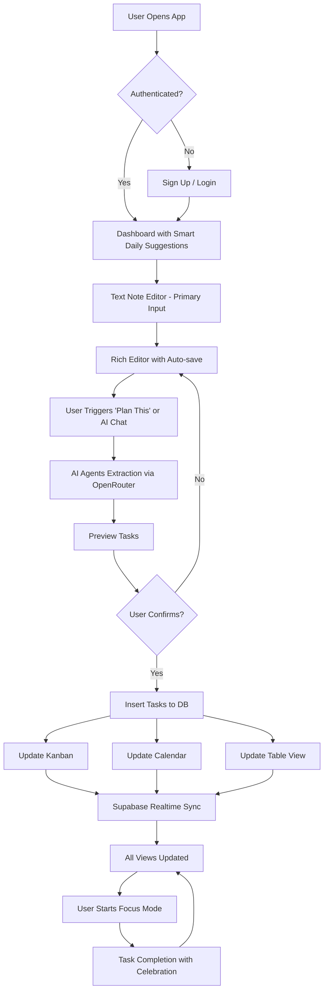

# "Groaly" - Product Idea & Requirements Spec

**Project Name:** Groaly (Goal + Reality)  
**Tagline:** "Dump your notes, AI Agents handle the rest"  
**Current Date:** January 2026  
**Document Version:** 3.0

---

## 1. Overview / Product Description

**What is this product?**  
**Groaly** is an AI Agents-powered productivity application that transforms your notes into organized, actionable task management systems. Users dump notes (text-first) and interact with AI through natural conversation to automatically extract tasks, set priorities, identify dependencies, suggest schedules, and manage everything through Kanban, Calendar, and Table views—all through intelligent prompting and agent orchestration with a powerful Focus Mode for execution.

**Core value proposition (UVP):**  
*"Store your notes, chat with AI Agents, get perfect task plans—zero manual organizing."*

**Primary target users:**
- Knowledge workers and developers (25-45 years old, tech-savvy)
- Busy professionals juggling multiple projects with chaotic note-taking habits
- Users who want AI to handle planning through conversation, not manual task creation
- People frustrated with existing task managers that require too much manual organization

**Business objectives:**
- Reduce time spent organizing tasks from 2 hours/week to <10 minutes/week
- Achieve 70%+ task completion rate (vs. ~40% industry average for manual planning)
- Target 1,000 active users within 6 months post-launch
- Differentiate through conversational AI Agents and intelligent task orchestration

---

## 2. Problem & Pain Points

**Critical Pain Points:**

1. **"I have tons of notes but they're just sitting there doing nothing."**
   - Current workflow: Take notes → never revisit → notes become digital graveyard
   - Need: AI that proactively transforms notes into actionable plans

2. **"My notes are a chaotic mess—I spend more time organizing than actually doing the work."**
   - Current state: 50+ unstructured notes in various apps, no clear next actions
   - Manual task extraction takes 1-2 hours weekly and still incomplete

3. **"I don't know what to work on first—everything feels urgent."**
   - No systematic prioritization → reactive instead of proactive
   - Missed dependencies cause tasks to fail or block later work

4. **"Task management apps require too many clicks—I just want to dump notes and have AI figure it out."**
   - Todoist/Asana: 5-8 steps to create one task with proper metadata
   - Users abandon these tools after a week due to friction

5. **"I need to see tasks in multiple views (list, board, calendar) but switching apps is tedious."**
   - Current workflow: Notion for notes → Trello for board → Google Calendar → manual sync = chaos
   - Data gets out of sync, causing duplicated/missed work

6. **"I want to just tell AI what I need and have it handle my schedule intelligently."**
   - Current tools: Dumb buttons and forms, no conversational intelligence
   - Need: Chat with AI like a personal assistant, have it orchestrate tasks automatically

**Nice-to-Have Improvements:**

7. **"I want to review my week and get AI suggestions on what I should adjust."**
   - No tools offer intelligent retrospective analysis

8. **"Privacy concerns: I don't want my notes sent to random AI APIs without control."**
   - Desire to bring own API keys for full control

**Before State (Current Workflow):**
User takes notes in various apps → notes sit unused → manually copy to task manager → manually categorize → manually schedule → update 3 different tools → half the tasks are forgotten.

---

## 3. Solution Vision / Overall Approach

**High-Level Solution:**  
"AI Agents-Powered Notes to Tasks" leverages conversational AI orchestration (Claude 3.7 Sonnet / Gemini 2.0 Flash via Vercel AI SDK) to create a seamless notes storage → AI conversation → intelligent task planning → focused execution pipeline. Users dump notes (text-first), chat with AI Agents to automatically extract tasks, set priorities, identify dependencies, optimize schedules, defend focus time, and execute in distraction-free Focus Mode—all synced across Kanban, Calendar, and Table views.

**Why this approach is superior:**
- **AI Agents conversation:** Natural language interface—just tell AI what you want ("plan this note", "optimize my week", "what should I do today")—no forms or manual clicking
- **Intelligent orchestration:** Multi-agent system handles task extraction, scheduling optimization, dependency resolution, and workload balancing autonomously
- **Notes as foundation:** All tasks derive from notes—maintains context and traceability, notes become your knowledge base
- **All-in-one:** Eliminates context-switching between 3-5 apps; everything stays synced via Supabase Realtime
- **Serverless & affordable:** Vercel + Supabase keeps costs low and scales effortlessly
- **Privacy option:** Users can bring their own API keys for full control

**Core Assumptions (If These Fail, Rethink the Product):**
1. Users prefer conversational AI interaction over manual forms/buttons for task management
2. LLMs (2026 era) can reliably extract structured tasks from messy notes with <10% error rate
3. Users trust AI Agents to prioritize/schedule/optimize tasks through conversation (vs. wanting full manual control)
4. Real-time sync is valuable enough to justify requiring internet connectivity
5. Users will pay $5-10/month for premium features after experiencing value

**Non-Goals / Out-of-Scope (Full-Feature Version):**
- ❌ No multi-user collaboration or project sharing (single-user focus)
- ❌ No voice input/capture (text is sufficient, web voice unreliable)
- ❌ No image/PDF OCR or multi-modal input
- ❌ No custom LLM fine-tuning (rely on OpenRouter's routing to best models)
- ❌ No complex workflow automation (e.g., IFTTT-style rules)
- ❌ No external calendar sync (two-way) - Groaly is single source of truth
- ❌ No meeting notes templates or recording features
- ❌ No browser extensions or quick capture tools (bookmark tab sufficient)

**Now IN-SCOPE (Full-Feature Version):**
- ✅ AI Chat Assistant with unified control (one-command magic merged in)
- ✅ Smart daily suggestions ("What should I work on today?" - Motion-style)
- ✅ Auto-balance workload optimization (Motion-style redistribution)
- ✅ Defend focus time & auto-schedule breaks (Reclaim.ai-style)
- ✅ Energy-based intelligent scheduling (complex tasks → morning)
- ✅ Focus Mode with PiP floating timer (Blitzit-style execution)
- ✅ Pomodoro timer integrated (25/5 customizable)
- ✅ Table/Database view (Notion-style power user view)
- ✅ Knowledge graph for related tasks/dependencies (Mem.ai-style)
- ✅ Time tracking (optional, background, non-intrusive)
- ✅ Weekly AI Review with insights and suggestions
- ✅ Full offline mode with sync queue (PWA capability)

---

## 4. Target Users & Personas

### Persona 1: Alex - The Hustling Freelancer
- **Age:** 28, Freelance Developer
- **Goals:** Juggle 4-5 client projects, never miss deadlines, maintain work-life balance
- **Frustrations:** 
  - "I take tons of notes during client calls but they just sit in my note app unused"
  - "I waste 2 hours every Monday manually converting notes to tasks in Todoist"
  - "I miss deadlines because I forget to check my task list"
- **Tech-savviness:** High (uses Notion, VS Code, GitHub)
- **Ideal outcome:** Dump project notes → chat with AI: 'plan this note' → AI auto-creates prioritized tasks with realistic schedules → visual Kanban keeps him on track

### Persona 2: Sarah - The Startup Founder
- **Age:** 34, Co-founder of a SaaS startup
- **Goals:** Stay on top of product development, fundraising, and team management simultaneously
- **Frustrations:**
  - "My brain is overloaded with 50 things daily—I need AI to organize, not just capture"
  - "I have 100+ notes but no system to turn them into actionable plans"
  - "I hate manually breaking down big goals into actionable steps"
- **Tech-savviness:** Medium-high (uses Slack, Trello, Google Workspace)
- **Ideal outcome:** Dump meeting notes → chat with AI: 'extract action items and schedule them' → AI auto-generates task plan with optimal scheduling

### Persona 3: Jordan - The Busy Professional
- **Age:** 41, Marketing Manager at a corporate firm
- **Goals:** Manage campaigns, coordinate with agencies, report to executives
- **Frustrations:**
  - "I switch between 5 apps daily just to track my work"
  - "I want to just ask AI 'what should I work on today' and get intelligent answers"
  - "I need weekly reviews but manually creating them takes an hour"
- **Tech-savviness:** Medium (comfortable with web apps, avoids complex tools)
- **Ideal outcome:** One app for notes → tasks → schedule, with conversational AI that handles planning through chat

---

## 5. Key Features / Epics

### Feature 1: Rich Text Note Storage & Editor – Priority: ★★★★★
**Value:** Core foundation—all tasks derive from notes. Primary and only input method for brain dumps.

**User Story:**  
*As a user, I want to type or edit notes with rich formatting so that I can capture my thoughts and ideas quickly without friction.*

**Acceptance Criteria:**
- Rich text editor (Tiptap) with basic formatting: bold, italic, bullet lists, numbered lists, headings
- Auto-save every 2 seconds (debounced)
- Markdown shortcuts supported (e.g., `##` for headings, `-` for lists, `**` for bold)
- Character/word count displayed (optional toggle)
- Responsive design (optimized for desktop, works on tablets/phones)
- Paste support from any source (web, docs, emails)
- Notes list view with search and filter

**Edge Cases:**
- Conflict resolution if user edits on two devices simultaneously (last-write-wins with notification)
- Pasting large amounts of text: Warn if >10,000 characters (may impact AI processing time)
- Offline editing: Queue changes locally, sync when reconnected (PWA)

**Success Metrics:**
- Average note length: 200-500 words
- 90%+ notes saved successfully with auto-save
- Average edit session: <3 minutes

---

### Feature 2: AI Agents Task Extraction & Orchestration – Priority: ★★★★★
**Value:** The core "magic"—AI Agents convert messy notes into actionable, prioritized tasks through intelligent conversation and orchestration.

**User Story:**  
*As a user with a chaotic note, I want to tell AI "plan this note" (via button or chat) and have AI Agents automatically extract all tasks with priorities, time estimates, dependencies, and suggested schedules so that I don't waste time organizing manually.*

**Acceptance Criteria:**
- "Plan this" button visible on every note (disabled if note <20 characters)
- User confirms action if note >2000 characters (cost warning: "This may use ~$0.05 AI credits")
- AI processes note via Vercel AI SDK + OpenRouter (Claude 3.7 Sonnet or Gemini 2.0 Flash)
- Structured output follows strict Zod schema:
  ```typescript
  {
    tasks: [{
      title: string (20-60 chars),
      description: string (detailed),
      priority: "high" | "medium" | "low",
      estimated_time_minutes: number,
      dependencies: string[] (task titles that must complete first),
      suggested_due_date: "YYYY-MM-DD" | null
    }]
  }
  ```
- AI logic (enhanced with Motion/Blitzit best practices):
  - **Smart prioritization**: Analyzes urgency keywords ("urgent", "ASAP", "deadline") + importance keywords ("critical", "must", "important") → Eisenhower Matrix scoring
  - **Workload balancing**: Distributes tasks to avoid overload (max 8 hours/day default), suggests optimal days based on energy levels (complex tasks → morning slots)
  - **Dependency detection**: Uses semantic understanding to find blockers ("before", "after", "depends on", "once X is done") + detects implicit dependencies (e.g., "design mockup" must precede "code UI")
  - **Time-aware scheduling**: Respects working hours (8AM-8PM default), avoids weekends unless specified, considers task duration when assigning slots
  - **Context preservation**: Maintains reference to original note section for each task (helps AI Chat Assistant answer "Why is this task here?")
  - **Subtask breakdown**: Auto-generates subtasks for large tasks (>4 hours) with separate estimates
- Tasks inserted into database with status "pending_review"
- User sees preview modal with all extracted tasks (editable before confirming)
- Bulk confirm inserts tasks into Kanban/Calendar

**Edge Cases:**
- No tasks detected: Display "No actionable tasks found. Try adding more details."
- Ambiguous priorities: Default to "medium"
- Circular dependencies: Break cycle and warn user
- API rate limits: Queue requests, show "Processing..." with estimated wait time

**Success Metrics:**
- 85%+ of extracted tasks accepted without edits
- Average extraction time: <5 seconds
- 90%+ user satisfaction with priority assignments (survey)

---

### Feature 3: Realtime Kanban Board – Priority: ★★★★★
**Value:** Visual task management with drag-and-drop, synced in real-time across devices.

**User Story:**  
*As a user, I want to see all my tasks on a Kanban board and drag them between columns so that I can organize work visually and see progress at a glance.*

**Acceptance Criteria:**
- Three default columns: "To Do" / "In Progress" / "Done" (customizable labels later)
- Alternative view: "Today" / "This Week" / "Backlog"
- Drag-and-drop tasks between columns (dnd-kit library)
- Updates persist to database immediately
- Supabase Realtime broadcasts changes to all open sessions
- Tasks show: title, priority badge, time estimate
- Click task to open detail modal (edit fields, mark complete)
- Color-coding: red (high), yellow (medium), gray (low)
- Responsive drag-and-drop (works on touch devices with long-press)

**Edge Cases:**
- Two users drag same task simultaneously: Optimistic UI, resolve with last-write-wins
- Network disconnect: Show offline badge, queue changes, sync when reconnected
- Empty columns: Display placeholder "Drag tasks here"

**Improvements (from Reflect/Motion):**
- Quick filters: "Show only high-priority", "Show blocked tasks", "Show today's tasks"
- Bulk actions: Select multiple tasks → move all, change priority, reschedule
- Card density toggle: Compact (title only) vs. Detailed (show description + subtasks)
- Swimlanes option: Group by priority or by project/note source

**Success Metrics:**
- 80%+ users interact with Kanban weekly
- Average session time on Kanban: 5-10 minutes
- Task completion rate: 70%+
- <2 seconds drag-and-drop response time

---

### Feature 4: AI-Powered Calendar View – Priority: ★★★★☆
**Value:** Automatically schedules tasks across days/weeks based on AI suggestions.

**User Story:**  
*As a user, I want to see my tasks on a calendar and trust that AI has scheduled them optimally so that I don't spend time manually planning my week.*

**Acceptance Criteria:**
- Calendar view (FullCalendar or custom component): week view by default, month view optional
- Tasks auto-assigned to dates based on:
  - Priority (high → earlier)
  - Dependencies (blockers first)
  - Estimated time (balance workload, max 8 hours/day)
  - User's working hours preference (default 8AM-8PM)
  - **Energy optimization**: Complex tasks → morning slots (9-11AM), routine tasks → afternoon
- Drag-and-drop to reschedule tasks
- Visual density indicator: Green (<6 hours), Yellow (6-8 hours), Red (>8 hours)
- **Auto-balance button**: "Optimize my week" → AI redistributes all tasks for balanced workload
- **Smart warnings**: When dragging task causes overload → tooltip: "This will overload Tuesday (9h). Move Task X to Wednesday?"
- Click date to add ad-hoc task
- Sync with Kanban: Completing task on calendar updates board
- **Time blocks**: Visual representation of tasks as time blocks (not just all-day events)

**Edge Cases:**
- Overloaded day (>10 hours scheduled): AI **auto-suggests** specific redistribution → user confirms with one click ("Move 3 tasks to Wed/Thu?")
- Past-due tasks: Highlight in red, **AI suggests** new realistic due dates based on current workload
- Unscheduled tasks: Appear in "Unscheduled" sidebar with "Auto-schedule" button
- Conflicting tasks (same time slot): AI detects and prompts resolution

**Success Metrics:**
- 75%+ of AI-suggested dates accepted without changes
- 85%+ of auto-balance suggestions accepted
- 70%+ users check calendar view at least 3x/week
- <1 second calendar re-render after task move

---

### Feature 5: Realtime Sync Across Views – Priority: ★★★★★
**Value:** Ensures data consistency across Notes, Kanban, and Calendar without manual refreshes.

**User Story:**  
*As a user working across multiple devices, I want changes to sync instantly so that I always see the latest state without refreshing.*

**Acceptance Criteria:**
- Supabase Realtime subscriptions on `notes` and `tasks` tables
- Changes broadcast to all active sessions within 500ms
- Optimistic UI updates (assume success, rollback on error)
- Visual indicator when sync occurs (subtle pulse animation)
- Conflict resolution: Last-write-wins with timestamp, notify user of conflicts

**Edge Cases:**
- User offline: Queue changes locally, sync when online
- High-latency connection: Show "Syncing..." badge, timeout after 10 seconds

**Success Metrics:**
- 99.5%+ sync success rate
- <1 second average sync latency

---

### Feature 6: Settings & Customization – Priority: ★★★☆☆
**Value:** Allows users to tailor the app to their workflow and preferences.

**User Story:**  
*As a user, I want to configure my working hours, choose my preferred AI model, and manage API keys so that the app works the way I want.*

**Acceptance Criteria:**
- Settings page with sections:
  - **Profile:** Name, timezone (auto-detected from browser), working hours (default 9AM-6PM)
  - **AI Preferences:** Choose LLM model via OpenRouter (Claude 3.7, Gemini 2.0, etc.)
  - **API Keys (Advanced):** Bring your own OpenRouter/OpenAI keys (for LLM)
  - **Privacy:** Toggle analytics, data export
- Changes saved to user profile table
- AI processing respects selected model and keys

**Edge Cases:**
- Invalid API keys: Validate before saving, show error
- Timezone changes: Re-calculate all task due dates

**Success Metrics:**
- 30%+ users customize at least one setting
- <5% invalid API key errors

---

### Feature 7: AI Chat Assistant (Conversational Task Manager) – Priority: ★★★★★
**Value:** Unified control center for all AI interactions - flexible conversation + one-command magic through prompt templates. Like Blitzit's Blitzy but more powerful.

**User Story:**  
*As a user, I want to chat with an AI assistant about my tasks and notes so that I can quickly extract insights, reorganize work, or get suggestions through natural conversation or quick commands.*

**Acceptance Criteria:**
- **Floating chat widget**: Bottom-right corner, expandable (minimized = small circle icon, expanded = 400x600px panel)
- **Context-aware**: AI has access to:
  - All user's notes (content + metadata)
  - All tasks (title, description, priority, due_date, status, dependencies)
  - Current calendar state (workload per day)
  - User preferences (working hours, timezone, energy levels)
  
- **Quick Action Buttons (One-Command Magic)**:
  - `/plan-week` → "Plan my week from all unprocessed notes" (scans all notes, extracts, schedules)
  - `/optimize-today` → "Optimize today's schedule based on current workload" (rebalance tasks)
  - `/whats-next` → "What should I work on next?" (suggests based on time/priority/blockers)
  - `/find-blockers` → "What tasks are blocking other work?" (find critical dependencies)
  - `/prep-tomorrow` → "Review and prepare tomorrow's schedule" (preview + suggest adjustments)
  - `/summarize-week` → "Summarize this week's progress" (completion rate, achievements)
  
- **Flexible Chat Interactions**:
  - **Extract tasks**: "Turn this note into tasks" / "Plan this note" → AI extracts + shows preview
  - **Summarize work**: "What did I complete today?" / "Show my week summary" → AI generates report
  - **Smart queries**: "Show me tasks related to Client A" → AI searches + lists
  - **Reschedule requests**: "Move all high-priority tasks to next week" → AI shows plan, user confirms
  - **Explain decisions**: "Why is this task scheduled for tomorrow?" → AI explains reasoning
  - **Quick edits**: "Change Task X priority to low" / "Mark Task Y as done" → AI updates
  - **Proactive suggestions**: "You have 3 overdue tasks. Should I reschedule them?" (AI initiates)
  - **Find connections**: "What tasks depend on Task X?" → show dependency tree
- **Streaming responses**: Use Vercel AI SDK streaming for real-time feedback
- **Message history**: Persisted per session (cleared on page refresh or user clears)
- **Quick actions**: AI responses include actionable buttons (e.g., "Reschedule these 3 tasks" → [Confirm] button)
- **Responsive panel**: Collapsible sidebar on smaller screens, always visible on desktop

**Edge Cases:**
- **Ambiguous requests**: "Reschedule everything" → AI clarifies: "Do you mean all pending tasks or just today's tasks?"
- **Large operations**: "Delete all tasks" → AI requires explicit confirmation: "This will delete 47 tasks. Type 'confirm delete' to proceed."
- **Rate limiting**: Max 50 messages/hour to prevent abuse
- **Offline**: Chat disabled when offline, shows "Connect to internet to chat with AI"

**Implementation Details:**
- **UI**: shadcn/ui Dialog component, floating + expandable
- **LLM**: Claude 3.7 Sonnet via Vercel AI SDK (streaming)
- **System prompt**: Inject user context (notes, tasks, calendar) + capabilities + tone
- **Tool calling** (AI can execute functions):
  - `extract_tasks(note_id)` → trigger task extraction
  - `update_task(task_id, updates)` → modify task
  - `search_tasks(query)` → find tasks
  - `reschedule_tasks(task_ids, new_dates)` → batch reschedule
  - `generate_summary(date_range)` → create report
  - `optimize_schedule(date_range, constraints)` → rebalance workload
  - `find_blockers()` → identify tasks blocking others
  - `suggest_next_task(time, energy_level)` → recommend task to work on

**Success Metrics:**
- 90%+ users try chat within first 2 weeks
- 70%+ users use chat at least 2x/week
- Average conversation length: 3-5 messages
- 85%+ user satisfaction with AI responses
- Quick actions used 60%+ of the time (vs. freeform chat)

---

### Feature 8: Smart Daily Suggestions (Morning Dashboard) – Priority: ★★★★★
**Value:** Answers "What should I work on today?" (Motion's killer feature) → reduces decision paralysis.

**User Story:**  
*As a user starting my workday, I want to see AI-curated suggestions for today so that I don't waste time deciding what to work on and can jump straight into focused work.*

**Acceptance Criteria:**
- **Morning greeting**: Dashboard shows personalized message: "Good morning [Name]! Here's your focus for today:"
- **Top 3 tasks for today**: AI selects based on:
  - **Due today or overdue** (highest priority)
  - **High priority** (user-assigned or AI-inferred)
  - **No blockers** (all dependencies complete)
  - **Realistic time** (total ≤ user's available hours today)
  - **Energy match**: Complex tasks if morning, routine tasks if late day
- **Quick insights**:
  - "🔥 2 high-priority tasks due today"
  - "⏰ 1 overdue task needs attention"
  - "🚧 3 tasks blocked (waiting on dependencies)"
  - "✅ You completed 5 tasks yesterday—great job!"
- **Suggested schedule**: "Start with [Task A] (2h), then [Task B] (1h), finish with [Task C] (30m)—total 3.5 hours"
- **One-click actions**:
  - "Start [Task A]" → moves to "In Progress" + starts timer (optional)
  - "Reschedule overdue tasks" → AI suggests new dates
  - "Show all tasks" → opens Kanban view
- **Blocked tasks alert**: "Task X is blocked by Task Y. Want to work on Task Y first?"
- **Quick wins section**: "Low-effort, high-impact tasks you can finish in <30 min" (motivational)
- **Adaptive**: If user completes suggested tasks early → AI suggests next batch
- **Time-sensitive**: If user opens app at 4 PM → AI adjusts: "You have 4 hours left today. Focus on [shorter tasks]."

**Edge Cases:**
- **No tasks**: "No tasks for today! Want to create some from your notes?"
- **All tasks blocked**: "All tasks are blocked. Here's what to unblock them: [list dependencies]"
- **Overloaded**: "You have 12 hours scheduled today (overloaded). I suggest moving [3 tasks] to tomorrow."

**Implementation Details:**
- **AI selection algorithm** (runs on dashboard load):
  1. Filter tasks: `status = 'todo' AND (due_date = today OR due_date < today OR priority = 'high')`
  2. Remove blocked: Check dependencies → exclude if any dependency not complete
  3. Sort by: Priority (high first) → Due date (earliest first) → Estimated time (shorter first)
  4. Balance time: Select top tasks until sum(estimated_time) ≤ user's working hours
  5. Add quick wins: Find tasks <30 min → show separately
- **Caching**: Cache suggestions for 1 hour (recompute if tasks change)
- **Personalization** (future): Learn from user behavior (e.g., user always starts with emails → suggest email-related tasks first)

**Success Metrics:**
- 80%+ users see dashboard suggestions daily
- 70%+ users start with a suggested task (click "Start")
- 65%+ of suggested tasks completed same day
- User survey: "Suggestions help me focus" → 85%+ agree

---

### Feature 9: Table/Database View (All Tasks Hub) – Priority: ★★★★★
**Value:** Notion-style database view for power users - central place to see ALL tasks with advanced sorting, filtering, and bulk operations.

**User Story:**  
*As a power user with tasks scattered across 50+ notes, I want a table/database view of all tasks so that I can perform bulk operations, advanced filtering, and see my full workload like Notion databases.*

**Acceptance Criteria:**
- **New view tab**: "Table" (icon: table/database) alongside Notes/Kanban/Calendar
- **Notion-style table**: All tasks displayed in sortable, filterable table:
  - **Columns** (customizable visibility):
    - Title (editable inline)
    - Status (To Do / In Progress / Done) - dropdown inline edit
    - Priority (High / Medium / Low) - color badge, inline edit
    - Due Date (date picker inline)
    - Estimated Time (number input, inline edit)
    - Source Note (link, clickable → jump to note)
    - Dependencies (multi-select tasks, inline edit)
    - Tags (multi-select, custom tags, inline edit)
    - Created Date (read-only)
    - Completed Date (read-only)
    - Time Spent (if tracking enabled, read-only)
  
  - **Sortable**: Click any column header → sort asc/desc
  - **Default sort**: Priority (high→low) → Due Date (earliest→latest)
- **Filters** (multi-select, combinable):
  - **Status**: To Do / In Progress / Done (default: show To Do + In Progress only)
  - **Priority**: High / Medium / Low
  - **Date range**: Today / This Week / This Month / Overdue / Unscheduled / Custom range
  - **Source note**: Filter by note title (useful for project-specific tasks)
  - **Tags**: Filter by custom tags
  - **Has dependencies**: Show only tasks with/without blockers
  - **Saved filter views**: Save filter combinations (e.g., "High Priority Overdue", "Client A Tasks")
  
- **Search**: Full-text search across task titles + descriptions (fuzzy search)

- **Bulk actions**: Select multiple tasks (checkboxes) → actions:
  - Change status (bulk)
  - Change priority (bulk)
  - Add/remove tags (bulk)
  - Reschedule (bulk - AI suggests optimal dates)
  - Mark complete (bulk)
  - Delete (bulk - with confirmation: "Delete 12 tasks?")
  - Move to different note (bulk)
  - Add dependencies (bulk)

- **Column customization**:
  - Show/hide columns (toggle visibility)
  - Reorder columns (drag column headers)
  - Column width resize
  - Preferences saved per user

- **Inline editing**: Click any cell → edit directly (debounced auto-save)
- **Quick add row**: "+ Add task" button at bottom → create task inline
- **Row actions** (hover → show icons):
  - Edit (opens detail modal)
  - Duplicate task
  - Delete
  - Jump to source note
**Edge Cases:**
- **Large task lists** (>1000 tasks): Virtual scrolling (only render visible rows - react-virtual)
- **Conflicting filters**: "Show completed + overdue" (completed can't be overdue) → show warning, ignore overdue filter
- **Deleted source note**: Task remains, source note shows "(deleted)" with option to re-attach
- **Concurrent edits**: Optimistic UI, resolve conflicts with last-write-wins + notification

**Implementation Details:**
- **UI**: TanStack Table v8 (react-table) - industry standard for complex tables
- **Performance**: 
  - Virtual scrolling (react-virtual) for >100 tasks
  - Debounced inline editing (save 1 second after last keystroke)
  - Pagination optional (if virtual scroll not sufficient)
- **State sync**: Changes in Table view → instantly update Kanban/Calendar (Supabase Realtime)
- **URL state**: Filters + sort persist in URL params (e.g., `/table?status=todo&priority=high&sort=due_date-asc`) → shareable links
- **Export**: CSV/JSON export of filtered view

**Success Metrics:**
- 80%+ users visit Table view at least 2x/week
- 70%+ users use filters regularly
- 50%+ users perform bulk actions
- 60%+ users customize columns
- Average time to find specific task: <5 seconds
- Power users spend 40%+ of time in Table view (vs. Kanban/Calendar)

---

### Feature 10: Knowledge Graph / Related Tasks (Smart Connections) – Priority: ★★★★
**Value:** Auto-discover connections between tasks/notes (Mem.ai's knowledge graph) → better dependency detection + context.

**User Story:**  
*As a user juggling multiple projects, I want to see which tasks are related to each other so that I can understand the bigger picture and avoid missing dependencies.*

**Acceptance Criteria:**
- **Auto-linking**: AI detects relationships between tasks/notes:
  - **Explicit dependencies**: User writes "After Task A, do Task B" → Task B.dependencies = [Task A]
  - **Semantic similarity**: "Design landing page" relates to "Code landing page UI" → AI suggests link
  - **Shared entities**: Both tasks mention "Client A" → grouped under Client A
  - **Temporal proximity**: Tasks created from same note or same time period → loosely related
- **Related Tasks panel**: When viewing a task detail modal → show "Related Tasks" section:
  - "Dependencies" (blockers)
  - "Dependent tasks" (tasks blocked by this one)
  - "Similar tasks" (AI-suggested based on content similarity)
  - "From same note" (tasks extracted from same brain-dump)
- **Visual graph view** (optional, post-launch): Network diagram showing tasks as nodes, dependencies as edges
- **Smart suggestions**: When creating task → AI suggests: "This might depend on [Task X]. Add as dependency?"
- **Auto-update dependencies**: If user completes Task A → notify: "Task B is now unblocked (was waiting on Task A)"

**Edge Cases:**
- **Circular dependencies**: AI detects loop (Task A → Task B → Task A) → warns user: "Circular dependency detected. Please review."
- **Too many relations**: Limit to top 5 most relevant related tasks (avoid clutter)
- **False positives**: User can dismiss suggested relations → AI learns (future: improve model)

**Implementation Details:**
- **Embeddings**: Generate embeddings for task titles + descriptions (OpenAI text-embedding-3-small via OpenRouter)
- **Vector search**: Store embeddings in Supabase (pgvector extension) → cosine similarity search for related tasks
- **Dependency graph**: Store in `tasks.dependencies` (jsonb array of task IDs)
- **Real-time updates**: When task completed → trigger webhook to notify dependent tasks

**Success Metrics:**
- 70%+ of auto-detected dependencies accepted by users
- 40%+ users explore Related Tasks panel
- 20% reduction in missed dependencies (compared to manual entry)

---

### Feature 11: Weekly AI Review (Retrospective & Planning) – Priority: ★★★★
**Value:** Provides insights and suggestions for improving productivity (Motion/Reflect-style retrospectives).

**User Story:**  
*As a user, I want a weekly AI-generated summary of completed vs. pending tasks with suggestions for next week so that I can improve my planning and celebrate wins.*

**Acceptance Criteria:**
- **Auto-generated every Sunday evening** (8 PM user's timezone)
- **Report sections**:
  - **Completion rate**: "You completed 23/30 tasks this week (77%)"
  - **Top achievements**: "🎉 Finished 3 high-priority tasks ahead of schedule"
  - **Bottlenecks**: "⚠️ 'Database setup' blocked 4 other tasks—consider prioritizing blockers earlier"
  - **Time analysis**: "You scheduled 35 hours but completed 28 hours worth of tasks (80% efficiency)"
  - **Overdue tasks**: "5 tasks rolled over from last week—reschedule or re-evaluate priority?"
  - **Suggestions for next week**: "Focus on: [top 3 priorities]. Consider delegating: [low-priority tasks]."
  - **Productivity insights**: "You're most productive on Tuesday mornings (90% completion rate). Schedule hard tasks then."
- **Delivered via**:
  - In-app notification (bell icon) with link to full report
  - Optional email digest (user can toggle in settings)
  - Accessible in "Reviews" archive (keep last 12 weeks)
- **Interactive**: User can click suggestions → auto-apply (e.g., "Reschedule these 5 tasks" → one-click reschedule)

**Success Metrics:**
- 70%+ users read weekly review
- 50%+ users apply at least one suggestion
- Correlation: Users who read reviews → 15% higher completion rate

---

### Feature 12: Focus Mode / Blitz Mode (Execution Layer) – Priority: ★★★★★
**Value:** Distraction-free execution environment (Blitzit's killer feature) - helps users actually complete tasks, not just plan them.

**User Story:**  
*As a user ready to work, I want to enter a distraction-free focus mode with a floating timer so that I can execute tasks without interruptions and stay in flow state.*

**Acceptance Criteria:**
- **Entry points**:
  - Select task(s) → click "Start Focus Session" button
  - AI Chat: "Start focus session on Task X"
  - Smart Daily Suggestions: "Start [Task A]" button
  
- **Focus Mode UI**:
  - **Fullscreen** (Fullscreen API) - immersive, distraction-free
  - **Minimalist interface**:
    - Hide sidebar, navigation, all non-essential UI
    - Show only: Current task title + description, Timer, Progress bar
    - Dark background with task content centered
  - **PiP Floating Timer** (Picture-in-Picture API) - stays on top when user switches tabs/windows
    - Small floating window (200x100px) with timer + task name
    - Works even when user switches to VS Code, browser, etc.
    - Pause/Resume/Stop controls

- **Pomodoro Timer Integration**:
  - Default: 25 min work / 5 min break (customizable in Settings)
  - Visual countdown timer (large, center screen)
  - Progress bar fills up during work session
  - Audio cue when work session ends (optional, toggle in Settings)
  - Prompt: "Work session complete! Take a 5-minute break?" [Continue Working] [Take Break]
  - Long break after 4 pomodoros (15 min, customizable)

- **Ambient Sounds** (optional):
  - Dropdown: White Noise / Rain / Coffee Shop / Forest / Ocean / Off
  - Looped audio files, volume control
  - Helps with focus, masks distractions

- **Distraction Prevention**:
  - Block browser notifications (Notifications API - requires permission)
  - If user switches tabs → gentle browser notification: "Stay focused! 💪 [Task Name]"
  - Visual: tab title shows "🔴 Focus Mode - 18:32 remaining"
  - Page Visibility API tracks if user leaves → log for insights

- **Task Completion**:
  - When timer ends OR user clicks "Mark Complete":
    - Celebration animation (confetti, checkmark grows)
    - Sound effect (optional, like Blitzit's dopamine hits)
    - Summary: "You completed Task X in 47 minutes! 🎉"
    - Auto-move task to "Done" column
    - Ask: "Ready for next task or take a break?" [Next Task] [Break] [Exit Focus]

- **Session History** (for insights):
  - Log: task_id, start_time, end_time, completed (boolean), interruptions (tab switches)
  - Used by Weekly AI Review for productivity insights

**Edge Cases:**
- **Fullscreen exit (Esc key)**: Show modal: "Exit focus mode? Your progress will be saved." [Exit] [Stay Focused]
- **Browser crash / refresh**: Resume session if <5 minutes passed, else count as interrupted
- **Multiple tasks queued**: After completing one → auto-start next with 2-min break in between
- **Offline**: Focus Mode works offline (timer runs locally), sync completion when reconnected

**Implementation Details:**
- **Fullscreen**: `document.documentElement.requestFullscreen()`
- **PiP Timer**: 
  ```typescript
  const video = document.createElement('video');
  const canvas = document.createElement('canvas');
  const ctx = canvas.getContext('2d');
  // Draw timer on canvas → stream to video → requestPictureInPicture()
  await video.requestPictureInPicture();
  ```
- **Pomodoro Logic**: setInterval() for countdown, localStorage to persist state
- **Ambient Sounds**: `<audio>` element with loop attribute, preload audio files
- **Notifications**: `Notification.requestPermission()` → `new Notification()`

**Success Metrics:**
- 70%+ users try Focus Mode within first week
- 50%+ users use Focus Mode at least 3x/week
- Tasks started in Focus Mode: 75%+ completion rate (vs. 60% without Focus Mode)
- Average focus session duration: 35 minutes (vs. 25 min Pomodoro standard = good!)
- User survey: "Focus Mode helps me complete tasks" → 85%+ agree

---

### Feature 13: Defend Focus Time / Protected Slots – Priority: ★★★★★
**Value:** Reclaim.ai's killer feature - protect deep work time from being scheduled over, prevent burnout with automatic breaks.

**User Story:**  
*As a user, I want to define protected time slots for deep work and breaks so that AI never schedules tasks during these times and I maintain sustainable productivity.*

**Acceptance Criteria:**
- **Protected Slots Configuration** (in Settings):
  - User defines recurring protected slots:
    - **Focus Time**: "Monday-Friday 9-11 AM" (deep work, complex tasks only)
    - **Lunch Break**: "12-1 PM daily" (no tasks)
    - **Gym/Habits**: "Monday/Wednesday/Friday 6-7 PM" (personal time)
    - **No Work After**: "8 PM" (hard stop, work-life balance)
  - Each slot has:
    - Title (e.g., "Morning Deep Work")
    - Days of week (multi-select)
    - Time range (start - end)
    - Type: Protected (no tasks) / Focus Only (only high-priority/complex tasks)
    - Recurring pattern (daily, weekdays, custom days)

- **AI Scheduling Respects Protected Slots**:
  - When auto-scheduling tasks → AI skips protected slots
  - When user manually drags task to protected slot → warning:
    - "This is your protected focus time. Are you sure?" [Yes, Override] [Cancel]
  - Visual on Calendar: Protected slots show as green-bordered blocks with pattern fill
  - Cannot be deleted by dragging tasks over them

- **Auto-Schedule Breaks**:
  - AI automatically inserts breaks based on work duration:
    - **15-min break** after 2 hours continuous work
    - **30-min lunch break** (user's preferred time, default 12-1 PM)
    - **10-min stretch break** every 90 minutes (optional, toggle in Settings)
  - Breaks show on calendar as light blue blocks
  - Browser notifications remind: "You've worked 2 hours straight. Take a 15-min break 🧘‍♂️"
  - Can be snoozed (5/10/15 min) but cannot be deleted

- **Focus Time Optimization**:
  - AI preferentially schedules complex/high-priority tasks during focus slots
  - Routine/admin tasks scheduled outside focus time
  - Respects user's energy profile (complex tasks → high energy slots)

- **Calendar Visualization**:
  - Protected slots: Green border, diagonal stripe pattern, label "Protected: Deep Work"
  - Auto-breaks: Light blue background, icon ☕ or 🧘‍♂️
  - Regular tasks: Normal color-coded by priority
  - Hover tooltip: "Protected slot - AI won't schedule tasks here"

- **Weekly Overview**:
  - Dashboard shows: "You protected 10 hours this week for deep work 💪"
  - Compliance tracking: "You respected 8/10 protected slots (80%)"
  - Suggestions: "Consider protecting 2-3 more hours next week for better focus"

**Edge Cases:**
- **Urgent tasks conflict with protected time**: AI suggests: "Task X is urgent but conflicts with your focus time. Override protection or reschedule to tomorrow?"
- **User consistently overrides**: After 3 overrides in a week → AI asks: "You've overridden focus time 3 times. Adjust your protected slots?"
- **Holidays/Special days**: User can temporarily disable protected slots for specific dates
- **Changing timezone**: Re-calculate all protected slots to new timezone

**Implementation Details:**
- **Data Model**:
  ```typescript
  protected_slots: [{
    id: string,
    user_id: string,
    title: string,
    days_of_week: number[], // [1,2,3,4,5] for Mon-Fri
    start_time: string, // "09:00"
    end_time: string, // "11:00"
    type: "protected" | "focus_only",
    enabled: boolean
  }]
  ```
- **Scheduling Algorithm**: Filter available slots before AI scheduling
- **Conflict Detection**: Check if task time range overlaps with protected slots
- **Notifications**: Browser Notification API at break times

**Success Metrics:**
- 80%+ users define at least one protected slot
- 70%+ compliance rate (users respect their protected slots)
- Users with protected slots: 20% higher task completion rate
- 90% reduction in burnout-related task deferrals
- User survey: "Protected time helps me focus" → 85%+ agree

---

### Feature 14: Time Tracking (Optional, Background) – Priority: ★★★☆☆
**Value:** Non-intrusive time tracking to improve future estimates and provide insights - completely optional.

**User Story:**  
*As a user who wants better time estimates, I want optional background time tracking so that I can see actual vs estimated time and improve my planning without manual tracking friction.*

**Acceptance Criteria:**
- **Settings Toggle**: "Enable Time Tracking" (default: OFF)
  - Clear description: "Automatically track time spent on tasks (runs in background, no manual start/stop needed)"
  - Privacy note: "Data never leaves your device, used only for improving your estimates"

- **Automatic Tracking** (if enabled):
  - Timer auto-starts when task moved to "In Progress"
  - Timer runs in background (no visible timer unless in Focus Mode)
  - Timer auto-pauses if user idle >5 minutes (Page Visibility API detects tab switch)
  - Timer auto-stops when task moved to "Done"
  - Time accumulated stored in `tasks.time_spent_minutes`

- **Compare Estimated vs Actual**:
  - Task detail modal shows: "Estimated: 2 hours | Actual: 2.5 hours"
  - Color-coded: Green (within 10%), Yellow (10-30% off), Red (>30% off)
  - Insight: "You took 25% longer than estimated"

- **AI Learning from History**:
  - After 10+ completed tasks with time tracking:
    - AI analyzes patterns: "You usually take 30% longer for design tasks, adjusting estimates..."
    - Future task extraction: AI adjusts estimates based on historical data
    - By task type (keywords): "design" → +30%, "code" → +10%, "meeting" → accurate
  - Dashboard insight: "Your estimates are improving! Now 85% accurate (up from 70%)"

- **Weekly Review Integration**:
  - If tracking enabled → Weekly Review includes:
    - "Time efficiency: You completed 28h of tasks in 32h actual time (87% efficiency)"
    - "Most accurate estimates: Coding tasks (95% accurate)"
    - "Needs improvement: Design tasks (only 65% accurate, consider adding buffer)"

- **Privacy & Control**:
  - User can delete time tracking data anytime
  - User can manually adjust tracked time (if timer was wrong)
  - Can disable mid-week without losing existing data
  - No forced tracking - completely opt-in

- **Minimal UI**:
  - No prominent timer widgets (unlike Toggl/Harvest)
  - Only shows in: Task detail modal, Weekly Review, Insights (if tracking enabled)
  - Badge on "In Progress" tasks: small clock icon (subtle, not intrusive)

**Edge Cases:**
- **Browser closed mid-task**: Timer state saved to localStorage, resumes on return (if <30 min passed)
- **Forgot to move to "Done"**: AI detects stale "In Progress" tasks (>24h) → asks: "Still working on this? Or mark done?"
- **Multiple tasks "In Progress"**: Only track active task (last one moved to "In Progress")
- **Disabled then re-enabled**: Historical data preserved, new tracking starts fresh

**Implementation Details:**
- **Storage**: Add column `tasks.time_spent_minutes` (integer)
- **Timer Logic**: 
  ```typescript
  // LocalStorage for persistence
  localStorage.setItem('active_timer', JSON.stringify({
    task_id: '123',
    start_time: Date.now(),
    accumulated_minutes: 45 // from previous sessions
  }));
  
  // Update every minute
  setInterval(() => {
    if (document.visibilityState === 'visible') {
      updateTimeSpent();
    }
  }, 60000);
  ```
- **Idle Detection**: Page Visibility API
- **AI Analysis**: Statistical analysis after N tasks (mean, median, variance by category)

**Success Metrics:**
- 30-40% users enable time tracking (not majority, that's OK - it's optional)
- For tracking users: 25% improvement in estimate accuracy after 4 weeks
- <5% users disable after trying (low churn = good UX)
- User survey: "Time tracking is non-intrusive" → 90%+ agree

---

## 6. User Flows & Wireframe Descriptions

### Flow 1: Onboarding & First Note Capture

1. **Landing Page:** User visits app → sees hero: "Dump your notes, AI Agents handle the rest"
2. **Sign Up:** Click "Get Started" → Supabase Auth magic link sent to email
3. **Email Verification:** User clicks link → redirected to app
4. **Profile Setup:**
   - Modal: "Welcome! Let's set up your workspace"
   - Fields: Name, Timezone (auto-detected from browser), Working Hours (default 9AM-6PM)
   - Button: "Start Organizing"
5. **Dashboard:** Clean interface with:
   - Top: Text editor (placeholder: "Type or paste your notes here...")
   - Sidebar: "Notes" / "Kanban" / "Calendar" / "Table" tabs (Kanban/Calendar/Table grayed out with "Process a note first" tooltip)
6. **First Note:**
   - User types or pastes: "I need to complete landing page for Client A, then setup database for Project B, and call partner about contract"
   - Auto-save indicator appears (subtle checkmark)
7. **AI Processing:**
   - User sees "Plan this" button (glowing green)
   - Clicks → Modal: "AI will extract tasks from your note. Continue?" (estimated cost: $0.02)
   - Confirms → Loading (3 seconds) → Preview modal shows 3 tasks:
     1. Complete landing page for Client A (High, 3 hours, due tomorrow)
     2. Set up database for Project B (Medium, 2 hours, due in 2 days, depends on task 1)
     3. Call partner about contract (High, 30 minutes, due today)
   - User reviews → clicks "Add to Workspace"
8. **Views Unlocked:** 
   - Sidebar "Kanban" tab lights up → user clicks → sees 3 tasks in "To Do" column
   - "Calendar" tab active → shows tasks on timeline
   - "Table" tab active → shows tasks in sortable table

**UI Style & Design System:**  
This project uses **shadcn/ui** with the following preset configuration:  
- **Style:** mira  
- **Base Color:** zinc  
- **Theme:** zinc  
- **Icon Library:** lucide  
- **Font:** Inter  
- **Menu Accent:** subtle  
- **Menu Color:** default  
- **Radius:** default  

**Setup Command:**  
```bash
bunx --bun shadcn@latest create --preset "https://ui.shadcn.com/init?base=base&style=mira&baseColor=zinc&theme=zinc&iconLibrary=lucide&font=inter&menuAccent=subtle&menuColor=default&radius=default&template=next" --template next
```

**Design Principles:**  
- Web-first responsive design (desktop optimized, mobile responsive secondary)  
- Minimal, clean interface with proper spacing  
- Consistent shadcn/ui component usage across all features  
- All UI/UX must adhere to the mira style + zinc color scheme for consistency

---

### Flow 2: Daily Workflow – Morning Review & Focus Mode

1. User opens app in desktop browser (7:30 AM)
2. Dashboard shows: "Good morning! Today's focus:" + 3 high-priority tasks auto-pulled from Smart Daily Suggestions
3. User clicks "Start [Task A]" button → enters Focus Mode:
   - Fullscreen activated
   - Pomodoro timer starts (25 minutes)
   - PiP floating timer appears
   - Ambient rain sounds playing (selected in Settings)
4. User completes Task A after 47 minutes → celebration animation → "Great job! 🎉"
5. Exits Focus Mode → sees Kanban view → Task A automatically in "Done" column
6. Realtime sync: Other browser tabs/devices update instantly
7. User clicks Calendar tab → sees today is slightly overloaded (red indicator: 9 hours scheduled)
8. Drags "Set up database" to tomorrow → Calendar recalculates, shows green (balanced)
9. Toast notification: "Good call! Your week is now balanced."

---

### Flow 3: Task Completion & Dependency Unlock

1. User completes "Call partner" task
2. In Kanban, drags card to "Done" column → card fades with checkmark animation
3. Realtime: Calendar view updates (task grays out)
4. Dependent task "Set up database" auto-highlights: "Blocker removed! Ready to start."

---

### Flow Diagram (Mermaid Syntax)



---

## 7. Technical Constraints & Preferences

### Tech Stack (Required)

**Frontend/Full-Stack:**
- **Framework:** Next.js 15+ (App Router, React Server Components, Server Actions)
- **Language:** TypeScript (strict mode)
- **UI Components:** shadcn/ui + Radix UI primitives + Tailwind CSS

**shadcn/ui Setup:**  
This project was created using the following command to ensure UI/UX complies with the specified shadcn/ui preset:  

```bash
bunx --bun shadcn@latest create --preset "https://ui.shadcn.com/init?base=base&style=mira&baseColor=zinc&theme=zinc&iconLibrary=lucide&font=inter&menuAccent=subtle&menuColor=default&radius=default&template=next" --template next
```

All UI/UX must adhere to this configuration (style=mira, baseColor=zinc, theme=zinc, iconLibrary=lucide, font=inter, etc.) to ensure consistency.

- **Rich Text Editor:** Tiptap (extensible, lightweight)
- **Drag-and-Drop:** dnd-kit (accessible, performant)
- **Calendar Component:** FullCalendar or custom via date-fns
- **Table Component:** TanStack Table v8 (for Table/Database view - sortable, filterable, Notion-style)
- **Virtual Scrolling:** react-virtual (for large task lists >100 items)
- **Charts (optional):** Recharts (for weekly review visualizations)
- **Focus Mode APIs:**
  - Fullscreen API (distraction-free mode)
  - Picture-in-Picture API (floating timer)
  - Page Visibility API (track user attention)
  - Notifications API (break reminders)
  - Web Audio API (ambient sounds)

**Backend & Database:**
- **Database:** Supabase (PostgreSQL)
  - Tables:
    - `users`: id, email, name, timezone, working_hours, energy_levels (jsonb), preferences (jsonb), created_at
    - `notes`: id, user_id, title, content, status (raw/processed), created_at, updated_at
    - `tasks`: id, user_id, note_id, title, description, priority, estimated_time_minutes, time_spent_minutes (nullable), dependencies (jsonb array), due_date, status (todo/in_progress/done), tags (jsonb array), order, embedding (vector), created_at, updated_at, completed_at
    - `protected_slots`: id, user_id, title, days_of_week (int array), start_time, end_time, type (protected/focus_only), enabled, created_at
    - `chat_messages`: id, user_id, role (user/assistant), content, tool_calls (jsonb), created_at
    - `weekly_reviews`: id, user_id, week_start_date, report_data (jsonb), created_at
    - `focus_sessions`: id, user_id, task_id, start_time, end_time, completed (boolean), interruptions (int), created_at
  - **Extensions**: pgvector (for task embeddings + similarity search)
- **Auth:** Supabase Auth (magic links, email/password)
- **Storage:** Supabase Storage (audio files, max 10MB per file)
- **Realtime:** Supabase Realtime subscriptions on `notes`, `tasks`, and `chat_messages` tables

**AI Services:**
- **LLM:** Vercel AI SDK v6+ with OpenRouter
  - Models: Claude 3.7 Sonnet (primary for task extraction, chat assistant), Gemini 2.0 Flash (cost-effective alternative)
  - Structured output via Zod schemas (type-safe)
  - Streaming support for real-time feedback (chat assistant)
  - Tool calling support (AI Chat Assistant functions)
- **Embeddings (Knowledge Graph):** OpenAI text-embedding-3-small via OpenRouter
  - Cost: ~$0.02/1M tokens
  - Stored in Supabase with pgvector extension for similarity search

**Deployment:**
- **Hosting:** Vercel (serverless functions, edge runtime)
- **CDN:** Vercel Edge Network (global low-latency)
- **CI/CD:** GitHub Actions + Vercel auto-deploy on push to `main`

### Performance & Scale Expectations

- **Initial Scale:** 100-1,000 users (full-feature launch)
- **Target Scale:** 10,000 users within 12 months
- **Response Times:**
  - AI task extraction: <5 seconds for typical note (200-500 words)
  - AI Chat Assistant: <2 seconds first token (streaming), <10 seconds full response
  - Realtime sync: <1 second across all views
  - Page load: <2 seconds (initial), <500ms (subsequent navigation)
  - Table/Database view: <1 second load time for 1000+ tasks (virtualized)
  - Focus Mode entry: <500ms (fullscreen + PiP timer activation)
  - Calendar auto-balance: <3 seconds to redistribute full week
- **Database:** Supabase free tier supports up to 500MB, upgrade to Pro ($25/month) at 1,000 users
- **Cost Guardrails:**
  - Cache AI Chat responses for similar queries (24h)
  - Cache task embeddings (regenerate only when task content changes)
  - Cache weekly reviews (no need to regenerate if user re-opens)
  - Rate limiting: 50 AI Chat messages/hour per user
  - Focus Mode: Runs fully client-side (no API costs)

### Language & Internationalization

- **Primary Language:** English (en-US)
- **i18n Strategy:** Not required for MVP (English-only)
- **Post-MVP:** Consider adding other languages based on user demand

### Security & Privacy

- **Data Encryption:** All data encrypted at rest (Supabase default) and in transit (HTTPS)
- **GDPR Compliance:** User can export all data (JSON), delete account (cascade delete all notes/tasks)
- **API Keys:** Support user-provided OpenRouter/OpenAI keys (encrypted in database)
- **Rate Limiting:** 100 API requests/minute per user (prevent abuse)

### Browser & Platform Support

**Primary Target (Desktop Web):**
- Chrome, Firefox, Safari, Edge (latest 2 versions)
- Optimized for 1920x1080 and 1366x768 resolutions

**Secondary Support (Responsive):**
- Tablets: iPad (Safari), Android tablets (Chrome)
- Mobile phones: iOS Safari 15+, Android Chrome 100+ (responsive layout, not optimized)

**Technology Stack:**
- Next.js 15+ (App Router, React Server Components, Server Actions)
- Progressive Web App (PWA) support (offline draft notes, sync queue)

### Monitoring & Analytics

- **Error Tracking:** Sentry (catch client + server errors)
- **Analytics:** PostHog (privacy-friendly, self-hosted option)
- **Metrics to Track:**
  - AI extraction accuracy (user feedback)
  - AI Chat Assistant usage (messages/user, satisfaction, quick action adoption)
  - Smart Suggestions acceptance rate
  - Auto-balance adoption rate
  - Task completion rate (overall + per view + Focus Mode vs non-Focus Mode)
  - Table/Database view usage (filters, bulk actions, column customization)
  - Knowledge Graph link acceptance rate
  - Focus Mode adoption (sessions/user, completion rate, average duration)
  - Protected slots compliance rate
  - Time tracking adoption (if enabled)
  - Weekly Review engagement (open rate, suggestion adoption)
  - Realtime sync latency
  - User retention (DAU/MAU)
  - Feature adoption funnel (which features used most)

---

**Next Steps (Full-Feature Roadmap):**

**Phase 1: Core Foundation (Weeks 1-3)**
1. Set up Next.js + Supabase + Vercel project skeleton
2. Implement Auth flow (magic links) + user profile setup
3. Develop rich text note editor (Tiptap) with auto-save
4. Database schema + migrations (users, notes, tasks, protected_slots, focus_sessions tables)
5. Notes list view with search

**Phase 2: AI Intelligence (Weeks 4-6)**
6. AI task extraction pipeline (Claude 3.7 + Zod schemas)
7. AI Chat Assistant (streaming, tool calling, quick action buttons)
8. Smart Daily Suggestions algorithm
9. Knowledge Graph (embeddings + pgvector setup)
10. Defend Focus Time logic (protected slots, auto-breaks)

**Phase 3: Views & Interactions (Weeks 7-9)**
11. Kanban board (dnd-kit) + realtime sync
12. Calendar view (FullCalendar) + auto-balance workload + energy-based scheduling
13. Table/Database view (TanStack Table + inline editing + bulk actions + column customization)
14. Related Tasks panel (similarity search)

**Phase 4: Execution & Polish (Weeks 10-12)**
15. Focus Mode (fullscreen + PiP floating timer + Pomodoro + ambient sounds)
16. Time Tracking (optional, background, non-intrusive)
17. Weekly AI Review generation + delivery + interactive insights
18. Settings & customization (working hours, energy profile, protected slots, Pomodoro settings, API keys)
19. UI/UX polish (animations, loading states, error handling, celebration effects)
20. Performance optimization (caching, virtual scrolling, edge functions)
21. PWA setup (offline mode, service worker, install prompt)

**Phase 5: Testing & Launch (Weeks 13-14)**
22. Comprehensive testing (unit, integration, E2E with Playwright)
23. Personal dogfooding (use for 2 weeks, fix issues, iterate based on real usage)
24. Documentation (user guide, feature walkthroughs, keyboard shortcuts)
25. Deploy to production (Vercel)
26. Monitor & iterate based on personal usage patterns

**Post-Launch Enhancements (If Needed):**
- Visual graph view (network diagram for dependencies)
- Advanced analytics dashboard (realtime insights beyond weekly review)
- Multi-language support (Vietnamese, Thai, etc.)
- Mobile native apps (React Native - if PWA insufficient)
- API for integrations (Zapier, Make.com)
- Export capabilities (PDF reports, CSV exports)
- Themes (dark mode enhancements, color schemes)